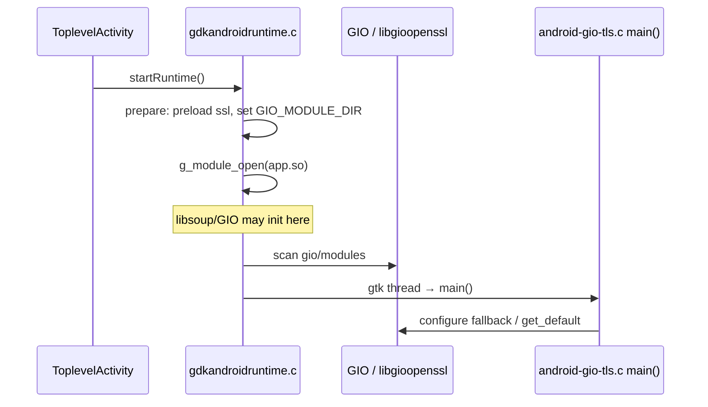

# Android runtime: TLS, IME hold-delete, Entry paste bubble

**Opened:** 2026-06-15 · **Updated:** 2026-06-17  
**Status:** **§2 IME fixed**, **§3 Paste fixed**, **§1 TLS — backend works locally; GLib patch + HTTPS harness landed in tree; device HTTPS retest pending**  
**Harness:** `org.roojs.ollmchat.gtkfixespoc` — backend status + **GET https://roojs.com/** button

### Build context

| Item | Value |
|------|-------|
| GTK | Upstream GNOME + `android-bugs.patch` (IME/paste) — **GTK wrap/patch handled separately** |
| `gtk.wrap` revision | `3ffe53adf8` (upstream GNOME GTK) |
| **GLib TLS patch** | `subprojects/packagefiles/glib/tls-ensure-before-scan.patch` + pin in `android/pixiewood-wraps/glib/glib.wrap` @ **2.84.0** |
| **TLS WIP branch** | `wip/android-tls-local-2026-06-17` |
| **TLS WIP patch dir** | `android/wip-patches/2026-06-17-tls-local-iteration/` |
| Runtime marker | `ollmchat-android-bugs-v4` |

### Device timeline (read this first)

| When | What's on the phone | TLS backend | Notes |
|------|---------------------|-------------|--------|
| 2026-06-16 23:01 | gtk `2a9597c92e` | **Fail** — `GDummyTlsBackend` | `non-registered extension point` in logcat |
| **2026-06-17 00:12** | **Local TLS WIP build** | **Pass** — `GTlsBackendOpenssl`, `ready=true` | First confirmation |
| **2026-06-17 00:39** | **Local TLS WIP build (retest)** | **Pass** — same log pattern | Reinstalled after PR detour |
| **2026-06-17 00:52** | **TLS WIP + HTTPS harness APK** | **Pass (cold start)** — `GTlsBackendOpenssl`, `ready=true` | Installed via `adb-install-gtk-fixes-poc.sh`; HTTPS button not tapped yet |
| **2026-06-17 00:55** | Same APK, HTTPS to roojs.com | **Backend pass, HTTPS fail** | Logcat: `UNKNOWN_CA` — no CA bundle in APK |
| **2026-06-17 (latest)** | **CA bundle APK** | **Pending HTTPS retest** | `assets/share/ssl/certs/ca-certificates.crt` + `SSL_CERT_FILE` init; harness installed |
| 2026-06-17 ~00:25 | gtk `af83724` PR validation APK | **Ignore for §1** | IME/paste only; not TLS WIP |

**Bottom line:** Yes — we got TLS **backend registration** working once, on the WIP build. That is **not** committed or on `gtk.wrap` yet. The fail lines in §1 are the **older baseline** (Jun 16), kept for comparison. The APK you installed for the PR check is **not** the passing TLS build.

### How we work

1. Agent updates this doc after each build and log capture.  
2. You test on device and report pass/fail.  
3. Agent lands fixes for **all open bugs in one gtk batch**, then one rebuild.  
4. Repeat.

**Logcat after repro:** `scripts/android/adb-gtk-fixes-logcat.sh --no-restart`

---

## 1. TLS (GIO backend) — **works on WIP build; not shipped**

### What we are aiming for

Harness cold start:

- Logcat: `GTlsBackendOpenssl` (not `GDummyTlsBackend`), `supports_tls=1`
- Harness label: **`Ready: GTlsBackendOpenssl`**
- No `non-registered extension point gio-tls-backend`, no `GIO TLS backend unavailable`

End-to-end HTTPS (after backend is ready):

- Tap **GET https://roojs.com/**
- Label: **`HTTPS 200 OK`**
- Logcat: `GTK fixes POC: TLS test status=200`

### Root cause (confirmed on device with debug GLib)

**Two bugs stacked:**

1. **GLib module scan order** — `g_io_modules_scan_all_in_directory()` could run before `_g_io_modules_ensure_extension_points_registered()`. `libgioopenssl.so` then failed with `Tried to implement non-registered extension point gio-tls-backend` and never registered.

   **Fix:** call `_g_io_modules_ensure_extension_points_registered()` at the start of `g_io_modules_scan_all_in_directory_with_scope()` (local patch in `subprojects/glib` / `~/gitlive/glib`).

2. **App fallback used wrong XDG API** — GDK sets data dirs via `g_set_user_dirs()`, which updates `g_get_system_data_dirs()` but **not** `g_getenv("XDG_DATA_DIRS")`. `android-gio-tls.c` only checked `g_getenv`, so Path B thought XDG was unset even after Path A succeeded, never called `get_default()` after GDK’s scan, and logged a false failure.

   **Fix:** in `main()`, call `g_tls_backend_get_default()` first; if GDK already registered OpenSSL, return success. Fall back to `GIO_MODULE_DIR`, then `g_get_system_data_dirs()`, then `g_getenv("XDG_DATA_DIRS")`.

### Device evidence

| Build | Date/time | Result |
|-------|-----------|--------|
| gtk `2a9597c92e` | 2026-06-16 23:01 | **Fail** |
| TLS WIP (local) | **2026-06-17 00:12**, **00:39 retest** | **Pass** |
| gtk `af83724` PR APK | 2026-06-17 ~00:25 | TLS not re-tested (IME/paste validation only) |

**Pass logcat (2026-06-17 00:12 — TLS WIP build only):**

```
OLLMchat-GIO: registered gio-tls-backend extension point
OLLMchat-GIO: loaded module .../libgioopenssl.so
OLLMchat-GIO: default gio-tls-backend = openssl (GTlsBackendOpenssl)
OLLMchat GDK TLS [after-scan]: backend=GTlsBackendOpenssl supports_tls=1
OLLMchat TLS [after-gdk]: ... g_get_system_data_dirs[0]=.../files/share backend=GTlsBackendOpenssl supports_tls=1
GTK fixes POC: TLS harness backend=GTlsBackendOpenssl ready=true
```

**Fail logcat (2026-06-16 23:01 — before fixes; gtk `2a9597c92e`):**

```
Tried to implement non-registered extension point gio-tls-backend
Found default implementation dummy (GDummyTlsBackend)
GIO TLS backend unavailable after scanning module directories
```

### What the bug actually is

This is **not** a libsoup bug. On Android, HTTPS needs GIO’s pluggable TLS backend:

```
Gtk app  →  libsoup (SoupSession)  →  GIO GTlsBackend  →  libgioopenssl.so  →  libssl.so / libcrypto.so
```

GIO ships a fallback **`GDummyTlsBackend`** that cannot do real TLS. The first successful registration of a TLS backend **wins permanently** — if anything calls `g_tls_backend_get_default()` before `libgioopenssl.so` registers, you are stuck on dummy and every HTTPS call fails.

Symptom on device: harness label shows something like `TLS failed: TLS support is not available` (or similar libsoup/GIO error).

### Is `GDummyTlsBackend` a GIO bug?

**No — it is deliberate GIO design**, not a broken TLS implementation we should patch inside GIO itself.

On desktop Linux, TLS comes from a **separate loadable module** (`libgioopenssl.so`, built from **glib-networking**), not from core `libgio.so`. Core GIO ships `GDummyTlsBackend` as a **placeholder** so that:

- Apps can link against GIO and compile without OpenSSL present.
- Code can call `g_tls_backend_get_default()` and always get a non-`NULL` object.
- If no real backend registered, operations fail with `G_TLS_ERROR_UNAVAILABLE` / *"TLS support is not available"* instead of crashing.

From GNOME `gdummytlsbackend.c` (in `libgio` itself):

- The dummy registers on extension point `"gio-tls-backend"` with name `"dummy"` and priority **-100** (lowest).
- `libgioopenssl.so` registers the same extension point with **higher** priority when it loads successfully.
- `g_tls_backend_get_default()` calls `_g_io_module_get_default()`, which picks the **best** registered implementation, or dummy if none.
- The result is cached with `g_once_init` — **first resolution wins for the process lifetime**.

So GIO is working as designed. Our problem is **Android integration**: we ship `libgioopenssl.so` inside the APK, but we are not getting it registered as the TLS backend before the dummy is cached.

**Should we look at GIO?** Yes, but at **how we use the GIO module API**, not by replacing `GDummyTlsBackend`:

| Layer | Responsibility |
|-------|----------------|
| **GIO (libgio)** | Extension point + dummy fallback + `get_default()` singleton |
| **glib-networking** | `libgioopenssl.so` — real OpenSSL backend as a GIO module |
| **Us (Android)** | Preload OpenSSL, set `GIO_MODULE_DIR`, load modules in the **correct order** |

**The ordering GIO expects** (this is the missing piece we have been circling):

1. **`_g_io_modules_ensure_extension_points_registered()`** — creates the `gio-tls-backend` extension point and registers dummy at -100. This normally runs *inside* the first `g_tls_backend_get_default()` call, not before a module scan.
2. **`g_io_modules_scan_all_in_directory()`** — `dlopen` `libgioopenssl.so`; its init hook calls `g_io_extension_point_implement()` and registers the real backend.
3. **`g_tls_backend_get_default()`** — should now return OpenSSL, not dummy.

**What goes wrong on Android (matches our logcat):**

- If we **scan before step 1**: `libgioopenssl.so` loads but extension point does not exist yet → `Tried to implement non-registered extension point gio-tls-backend` → module does not register.
- If we **`get_default()` before step 2**: only dummy exists → singleton caches `GDummyTlsBackend` → **no recovery** even if we scan afterwards.

Commit `9dfe203627` failed because of the first case. Commit `de954aebba` (scan after `g_module_open`) may still fail because we scan **without** explicitly running step 1 first, and something may still call `get_default()` before `libgioopenssl.so` registers.

**Likely next fix (GIO-aware):** in `gdk_android_scan_gio_modules()`, call `_g_io_modules_ensure_extension_points_registered()` (GIO private API in `giomodule-priv.h`) **before** `g_io_modules_scan_all_in_directory()`, then only call `g_tls_backend_get_default()` after scan. Worth an upstream question/patch to GNOME if a public “ensure extension points exist” API is needed for embedded platforms.

References: [GTlsBackend.get_default](https://docs.gtk.org/gio/type_func.TlsBackend.get_default.html) (returns dummy if no backend), [TLS_BACKEND_EXTENSION_POINT_NAME](https://docs.gtk.org/gio/const.TLS_BACKEND_EXTENSION_POINT_NAME.html), `gio/gdummytlsbackend.c` in GNOME glib.

### How Android is supposed to work (packaging)

| Piece | Where in APK | Where at runtime (after GTK extracts assets) |
|-------|----------------|-----------------------------------------------|
| `libgioopenssl.so` | `assets/share/gio/modules/` | `files/share/gio/modules/` |
| `libssl.so`, `libcrypto.so` | `lib/arm64-v8a/` (jniLibs) | Same path, preloaded with `RTLD_GLOBAL` |
| App `.so` | `lib/arm64-v8a/libollmchat-android-gtk-fixes-poc.so` | Loaded by GTK runtime |

**Packaging is verified and correct** — `verify-gtk-fixes-apk.sh` / `verify-apk.sh` check:

- `assets/share/gio/modules/libgioopenssl.so` present
- `libssl.so` / `libcrypto.so` **not** under `assets/share/gio/modules/` (GIO would try to load them as modules and fail)
- Runtime marker `ollmchat-android-bugs-v4` in APK assets

On device, `run-as org.roojs.ollmchat.gtkfixespoc ls files/share/gio/modules/` shows:

```
libgioenvironmentproxy.so
libgioopenssl.so
```

So this is a **runtime init-order / registration** problem, not missing files.

### Startup sequence (two init paths — easy to get wrong)

There are **two** places that try to configure TLS. Both must cooperate; either can fail the whole thing.

**Path A — GTK Android runtime** (`gdk/android/gdkandroidruntime.c`), on Java main thread, before `main()`:

1. Set `XDG_DATA_DIRS` → `files/share`
2. `gdk_android_prepare_tls_modules()` — preload `libssl`/`libcrypto` from app native lib dir; set `GIO_MODULE_DIR=files/share/gio/modules` (**no scan yet**)
3. `g_module_open(application.so)` — pulls in GTK, GIO, libsoup, etc.
4. `gdk_android_scan_gio_modules()` — `g_io_modules_scan_all_in_directory()`

**Path B — app `main()`** (`ollmapp/android/android-gio-tls.c`), on GTK thread, before `GtkApplication` starts:

1. `ollmapp_configure_android_gio_tls_modules()` — if backend already non-dummy, return; else preload OpenSSL, scan module dirs (`XDG_DATA_DIRS`, maps fallback), call `g_tls_backend_get_default()`



**Core constraint:** `libgioopenssl.so` must register as the TLS backend **before** the first `g_tls_backend_get_default()` that pins dummy — but **after** GIO has registered its `gio-tls-backend` extension point (or module load fails silently).

### Where we are (summary)

| Check | Result |
|-------|--------|
| APK packaging | **Pass** (unchanged) |
| `libgioopenssl.so` on device | **Present** |
| TLS backend on **WIP build** (2026-06-17 00:12) | **Pass** — `GTlsBackendOpenssl` |
| TLS backend on **gtk.wrap `af83724`** (PR APK) | **Unknown / expect fail** until WIP lands |
| HTTPS via libsoup button | **Harness restored** — device retest pending |

**How to read the Jun 16 failure:**

1. **`non-registered extension point`** — scan before extension points existed (fixed by GLib ensure-before-scan).
2. **`GDummyTlsBackend`** — dummy cached before OpenSSL registered.
3. **`GIO TLS backend unavailable...`** — Path B false failure: `g_getenv("XDG_DATA_DIRS")` while GDK uses `g_set_user_dirs()`.

**Resume TLS work:**
```bash
git checkout wip/android-tls-local-2026-06-17
```

### Debug tooling (2026-06-17 iteration)

| Layer | What | Where |
|-------|------|-------|
| **GLib** | `OLLMchat-GIO:` logs for ensure, scan, load, default backend | `~/gitlive/glib` → copied to `subprojects/glib` for local builds |
| **GDK runtime** | `OLLMchat GDK TLS [after-scan]` after module scan | `subprojects/gtk/gdk/android/gdkandroidruntime.c` (local, not in `gtk.wrap` yet) |
| **App** | `OLLMchat TLS [after-gdk]` probe in `main()` | `ollmapp/android/android-gio-tls.c` |
| **Harness** | Backend status + libsoup HTTPS button | `ollmapp/android/AndroidGtkFixesPoc.vala` |
| **Logcat** | `scripts/android/adb-gtk-fixes-logcat.sh` | filters `OLLMchat`, `GDummy`, `gio-tls-backend` |

**Local rebuild (incremental, no full Pixiewood):** copy debug `subprojects/glib`, `ninja` `libgio-2.0.so` + `libgtk-4.so` + harness `.so`, stage jniLibs, `gradlew assembleDebug`. Full recipe still via `PIXIEWOOD_MANIFEST=android/pixiewood-gtk-fixes-poc.xml scripts/android/build-pixiewood-apk.sh`.

### What we believe was wrong (now resolved)

GIO design was correct. We failed on (1) scan-before-ensure and (2) app-side XDG/env mismatch.

### Attempts so far (what we tried — not “the root cause”)

| Commit / change | Intent | Device result |
|-----------------|--------|---------------|
| Patch era `android-bugs.patch` | Popup, IME, TLS preload scaffolding | TLS broken |
| Stop shipping `libssl`/`libcrypto` in `gio/modules` assets | GIO was loading them as modules | Packaging fixed; TLS still broken |
| `9dfe203627` — scan **before** `g_module_open` | Register TLS before app libs pull in GIO | **Dead end** — `non-registered extension point` |
| `de954aebba` — scan **after** `g_module_open` | Extension point should exist after dlopen | **Still broken** — scan before ensure |
| `android-gio-tls.c` early-return if non-dummy backend set | Avoid redundant scan in `main()` | Never triggered — never detected GDK success |
| `android-gio-tls.c` remove early `get_default()` before scan | Don’t pin dummy from app | Partial |
| **Local GLib** — ensure before scan + `OLLMchat-GIO` debug | Fix module registration order | **Pass** — OpenSSL registers |
| **`android-gio-tls.c`** — `get_default()` after GDK; `g_get_system_data_dirs()` | Fix false Path B failure | **Pass** — `ready=true` |
| **`gdkandroidruntime.c`** — log backend after scan | Confirm Path A end state | **Pass** — `GTlsBackendOpenssl` |

### Do not do this (dead ends)

- **Do not** put `libssl.so` / `libcrypto.so` under `assets/share/gio/modules/` — GIO treats them as loadable modules; breaks init.
- **Do not** scan GIO modules before `_g_io_modules_ensure_extension_points_registered()` — `libgioopenssl.so` cannot register (log line above). Scanning before `g_module_open` was one way we hit this (`9dfe203627`).
- **Do not** assume `libgioopenssl.so` is missing from the APK or filesDir — it is present; verify scripts pass.
- **Do not** call `g_tls_backend_get_default()` before a successful module scan — pins `GDummyTlsBackend` with no recovery.
- **Do not** blame GIO for shipping `GDummyTlsBackend` — it is intentional; fix module load order instead.
- **Do not** mix TLS `gdkandroidruntime.c` changes into `android-bugs.patch` — IME/paste ship via patch; TLS lands separately.

### Landed in tree (2026-06-17)

| Item | Location | Notes |
|------|----------|-------|
| **GLib ensure-before-scan** | `subprojects/packagefiles/glib/tls-ensure-before-scan.patch` | Production patch only (no `OLLMchat-GIO` debug). Pin via `android/pixiewood-wraps/glib/glib.wrap` @ 2.84.0. Regression: `test-r13-glib-tls-ensure-before-scan.sh`. |
| **`android-gio-tls.c`** | `ollmapp/android/` | Backend probe + `SSL_CERT_FILE` → bundled `share/ssl/certs/ca-certificates.crt` |
| **CA bundle in APK** | `build-pixiewood-apk.sh` | Copies host `/etc/ssl/certs/ca-certificates.crt` → `assets/share/ssl/certs/` |
| **Harness HTTPS** | `AndroidGtkFixesPoc.vala` + `libsoup-3.0` in `meson.build` | Button restored; device retest pending |
| **GTK runtime** | `android-bugs.patch` | IME/paste only — **not** TLS; managed separately |

Local `subprojects/glib` may still carry **WIP `OLLMchat-GIO` debug** logs from iteration; the ship patch does not. Rebuild from wrap to drop debug.

### Still pending

1. **Device test** — rebuild/install harness APK; confirm backend pass + **HTTPS 200** on button tap.
2. **Formal ship** — one Pixiewood rebuild with new glib wrap + app changes; update checklist below.

**Key files:** `subprojects/packagefiles/glib/tls-ensure-before-scan.patch`, `ollmapp/android/android-gio-tls.c`, `ollmapp/android/AndroidGtkFixesPoc.vala`

---

## 2. IME hold-delete — **FIXED**

### What we are aiming for

Hold backspace on the soft keyboard in a `Gtk.Entry` deletes continuously; app does not hang.

### Where we are

**Fixed** on device (`2a9597c92e`, confirmed 2026-06-16).

### What fixed it (kept in `af83724a96`)

- `ToplevelActivity` — `getInputType()` instead of `TYPE_NULL`
- `ImContext.setComposingText` — GTK preedit only, no full Editable sync
- `ImContext.finishComposingText` — skip `syncEditableFromGtk` when Editable empty after super
- `ImContext.sendKeyEvent` — `KEYCODE_DEL` → native `deleteSurrounding`

Debug logging (`OLLMchat.IME`) removed in `af83724a96`.

**Key files:** `gdk/android/glue/java/org/gtk/android/ImContext.java`, `ToplevelActivity.java`

---

## 3. Paste bubble — **FIXED**

### Desired touch UX (intentional — keep this)

- **Magnifier** during hold only when the field has text (`length > 0`).
- **Copy/paste bubble** on finger release, not at long-press recognition.

### What we are aiming for

Nested `Gtk.Window` → `Gtk.Entry`:

| Flow | Steps | Result |
|------|-------|--------|
| **A** | Long-press blank field → release | Copy/paste bubble |
| **B** | Long-press → drag to select → release | Copy/paste bubble |

### Where we are

**Both flows pass** on device (`2a9597c92e`, confirmed 2026-06-16).

### What fixed it (kept in `af83724a96`)

- `28bb73ace7` — bubble on release (`in_long_press` + click release); magnifier only if text
- `56506721e5` — `gtk_text_drag_gesture_end` shows bubble when touch selection exists
- `gdkandroidpopup.c` — parent bounds sync before popup layout (`23209d03e5`+)

Debug logging (`OLLMchat.Paste`, `OLLMchat.Popup`) removed in `af83724a96`.

**Key files:** `gtk/gtktext.c`, `gdk/android/gdkandroidpopup.c`

---

## Harness and commands

```bash
PIXIEWOOD_MANIFEST=android/pixiewood-gtk-fixes-poc.xml \
  scripts/android/build-pixiewood-apk.sh
./scripts/android/adb-install-gtk-fixes-poc.sh
./scripts/android/adb-gtk-fixes-logcat.sh              # cold start + dump
./scripts/android/adb-gtk-fixes-logcat.sh --no-restart
```

**Harness:** Backend status on launch + **GET https://roojs.com/** for end-to-end TLS.

**HTTPS test URL:** `https://roojs.com/` (not `example.com` — that host’s cert is rejected as unacceptable on Android even with a working `GTlsBackendOpenssl`).

### HTTPS failure (2026-06-17 logcat, roojs.com)

Backend registration **passes**; end-to-end HTTPS **fails at certificate verification**:

```
GSocketClient: TCP connection successful
GSocketClient: Connection successful!
GTK fixes POC: TLS test failed: Unacceptable TLS certificate
```

**Local host check (same machine as build):** `openssl s_client` to roojs.com → Let's Encrypt **E8** chain, `Verify return code: 0 (ok)`, TLS 1.2. The server cert is fine; Android is failing verification.

**Likely cause:** APK has `libssl.so` + `libgioopenssl.so` but GIO/OpenSSL is **not** using a CA bundle that includes Let's Encrypt **E8**. Next harness build logs `OLLMchat TLS trust:` paths and `accept_certificate` error flags (expect `UNKNOWN_CA`).

**Confirmed on device (2026-06-17 01:00, diagnostic APK):**

```
OLLMchat TLS trust: SSL_CERT_FILE=(unset) SSL_CERT_DIR=(unset)
OLLMchat TLS trust: path /etc/ssl/certs/ca-certificates.crt exists=0
OLLMchat TLS trust: path /system/etc/security/cacerts exists=1
GTK fixes POC: session tls_database=set
GSocketClient: Connection successful!
GTK fixes POC: accept_certificate subject=CN=roojs.com issuer=C=US,O=Let's Encrypt,CN=E8 errors=0x1 (UNKNOWN_CA)
GTK fixes POC: TLS test failed domain=g-tls-error-quark code=2 message=Unacceptable TLS certificate peer_errors=0x1 (UNKNOWN_CA)
```

Server cert is read correctly; verification fails because the **issuer is unknown** to GIO's trust store (not a bad cert on roojs.com). Android's `/system/etc/security/cacerts` exists but OpenSSL/GIO is not loading it. **Next fix:** ship a CA bundle in assets and point `SSL_CERT_FILE` (or wire `GTlsDatabase`) before HTTPS.

**Logcat (TLS):** look for `OLLMchat-GIO`, `OLLMchat GDK TLS`, `OLLMchat TLS`, `GTlsBackendOpenssl`, `GDummyTlsBackend`, `GTK fixes POC: TLS test status=`.

---

## GTK fork changelog (device results)

| Commit | Area | Change | Device result |
|--------|------|--------|---------------|
| `23209d03e5` | TLS/popup | Fork baseline | TLS broken |
| `9dfe203627` | TLS | Scan before `g_module_open` | **Dead end** |
| `de954aebba` | TLS | Scan after `g_module_open` | Still broken |
| `28bb73ace7` | Paste | Bubble on release UX | Flow A pass |
| `56506721e5` | IME/paste | Input type, IME paths, drag-end bubble | §2 §3 **fixed** |
| `af83724a96` | IME/paste | Remove debug logging | in `gtk.wrap` |

---

## Checklist

- [x] **IME** — hold backspace — **fixed** (`af83724a96`)
- [x] **Paste A** — blank → release — **fixed**
- [x] **Paste B** — drag-select → release — **fixed**
- [x] **TLS backend** — `GTlsBackendOpenssl` on cold start — **fixed locally** (2026-06-17)
- [x] **GLib patch** — ensure-before-scan in `tls-ensure-before-scan.patch` + wrap pin — **landed in tree**
- [x] **Harness HTTPS button** — libsoup `GET https://roojs.com/` — **restored in tree**; device retest pending
- [ ] **TLS HTTPS** — tap button → `HTTPS 200 OK` — **fail: UNKNOWN_CA** (2026-06-17 01:00); need CA trust store
- [ ] **Ship** — one formal Pixiewood rebuild + install with glib wrap + app changes
