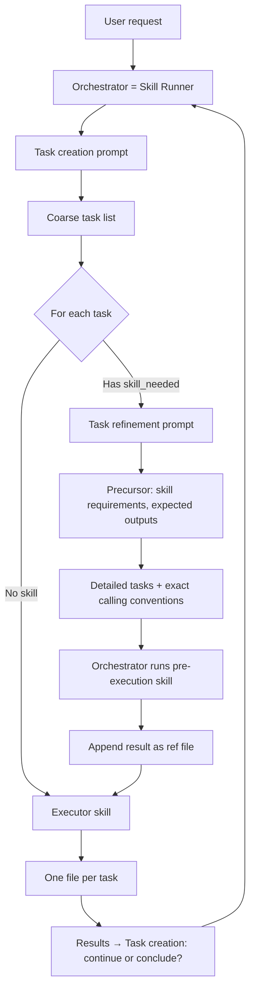

# 1.23.2 Three Prompt Types and Orchestration

## Overview

This plan moves the skills system toward a **three prompt-type** architecture (with task creation in two variants) aligned with our existing **markdown-focused input and output** (task list format, Result summary, Tasks with Skill/Query/Reference/Output, Edit sections in `skill.template.md` and `task_creator`). The types are:

1. **Task creation (initial)** — decompose a high-level goal into a coarse list of tasks and **which skills** are needed (no detailed parameters).
2. **Post completion (intermediary analysis)** — given the **full** task list (completed tasks have output references; remaining tasks do not) and precursor that includes completed-task outputs, **refine the requirements** of all tasks that do not yet have output, using the new information. Output is the **whole task list again** in the same format as task creation. Uses a **different prompt** from the initial one. The Runner infers continue/conclude from whether there remain tasks without output.
3. **Task refinement** — take a coarse task (with a skill name) and produce a **detailed** task list: exact skill parameters, queries, and reference files so the orchestrator can run skills and then executors.
4. **Task execution** — given a fully specified task (query + reference files only; no tool use inside the agent), produce **exactly one file** (markdown or code). Any “tool” (e.g. semantic search) is **run by the orchestrator before** the executor; the executor only consumes the resulting file(s).

Design principles:

- **Skills as pre-execution calls:** A task may declare a **skill** (e.g. `semantic_search`). The orchestrator executes that skill once, turns the result into a reference file, then passes (query, reference_files) to an execution agent. Executors never call tools; they only read files and write one file.
- **Separation of action vs task-creation:** Task-creation and task-refinement agents are **decomposers** (output: task list). Execution agents are **executors** (output: one file). We do not mix “create tasks” and “perform actions” in the same agent call.
- **Markdown I/O throughout:** All agent inputs and outputs use the same markdown conventions we have in `task_creator` and `skill.template.md` (Result summary, Tasks with Skill/Query/Reference/Output, optional Edit sections).

No coding or new behaviour beyond this plan until the plan is approved.

## Status

**PLAN** — Implementation not started.

## Dependencies and relationship to plan 1.23

- **Plan 1.23** (Skills Agent & Conductor) defines the Conductor, task format, and skills ecosystem. **1.23.2** refines that: task creation and refinement are **prompts** (not skill files), but the **initial** process still receives a **set of skills** (a catalog: names + descriptions) so it can decide which skills to put in the plan. The **executor** phase uses the actual **executable skills** in `resources/skills`. So we have two uses of “skills”: (1) **skill catalog** for the planner — which skills exist and when to use them; (2) **executable skills** for the Runner — the real skills that get run.
- Plan 1.23.1 (Skill Runner in occoder): skill files, templates, Runner, Manager, Definition.

## Conventions (aligned with 1.23 / 1.23.1)

- **Prompts** for task creation and task refinement live under **`resources/skill-prompts`** (markdown prompt templates / instructions). These are not full “skill files”; they drive the first two stages.
- **Skills** (executors only) live under **`resources/skills`**; skill files are YAML frontmatter + markdown body. Only the **executor** is a real skill; task creation and task refinement are prompt-driven.
- **No annotations below the divider:** In prompt-creation plans (1.23.3, 1.23.4, 1.23.5, 1.23.6), content **below** the `---` is **exact** prompt content only. No annotations, no explanatory text, no parenthetical notes below the divider — only prompt text and placeholder tokens. All annotation and placeholder meanings go **above** the divider. This keeps the template as copy-paste prompt content only and avoids confusion.
- Task list format remains **markdown**: bullet lists with **Skill**, **Query**, **Reference**, **Output** (and where we introduce pre-execution skills, a **Skill call** or equivalent field filled in by the refiner).
- The **orchestrator** is our current **Skill Runner** (liboccoder `Skill/Runner`). It is responsible for: choosing and loading the right prompt or skill (creation / refinement / execution), executing any declared skill call before an executor, and passing only (query, reference_files) to executors. No separate orchestrator component.

---

## 1. The prompt types (task creation in two variants + refinement + execution)

| Type            | Role                         | Input (conceptual)              | Output (conceptual)                          |
|-----------------|------------------------------|---------------------------------|----------------------------------------------|
| **Task creation (initial)** | Strategic decomposition      | Goal, optional reference files  | Coarse task list: query + which skill (if any) |
| **Post completion** | Refine remaining tasks using completed outputs | **Full** task list + precursor (incl. completed-task outputs) | **Whole task list** again (same format as task creation); completed tasks unchanged, remaining tasks refined. |
| **Task refinement** | Define exact calling conventions | One coarse task + **precursor data**: skill requirements, expected outputs, etc. | Detailed task list with **exact calling conventions** (skill name, parameters, refs, output spec). End state is ready to **call executors**. |
| **Task execution** | Produce one artifact         | Query + reference files only    | Exactly one file (e.g. `.md`, `.json`, `.jsx`) |

- **Task creation** has **two prompts**: (1) **initial** — goal → coarse task list; (2) **post completion** — full task list (with completed tasks having output references) + precursor → refine remaining tasks and output the whole task list again. The post-completion prompt is different because it receives a task list with some outputs and refines the rest using that information; the Runner infers continue/conclude from the returned list.
- **Task refinement** and both task-creation variants are “decomposer” behaviours (output = task list or decision + optional tasks). None requires a full skill file; they use prompts from **`resources/skill-prompts`**.
- **Task refinement** can be **re-run with system feedback** (e.g. missing commands, parse errors). It does not need conversation history — it only updates the task list given current task list + feedback.
- **Planning involves no execution:** Task creation (initial) **does not execute anything**. It only uses gathered information (user goal, optional reference files) to **devise a plan** (the task list). The only state it produces is the **plan** itself. The post-completion step is the **intermediary analyst**: it receives the full task list (completed tasks have output refs; remaining do not) and precursor with those outputs, and refines the remaining tasks; it outputs the whole task list again so the Runner can run the next set or conclude.
- **Task execution** is “executor” behaviour (output = single file). **Executors are the only real skills**; they are typically **wrappers around a distinct tool** (shell commands, web search, codebase search, etc.). The orchestrator (Skill Runner) runs the executor after any pre-execution skill has been run and its result attached as a reference file.

---

## 2. Task structure and skill-as-pre-execution

Every **executable** task is a triple:

- **Query** — what the executor should do (natural language).
- **Reference files** — zero or more files (names + content or paths) given to the executor.
- **Skill** (optional) — a **single** pre-execution step: the orchestrator runs it, gets a result, and **appends that result as a new reference file** before calling the executor. The executor never sees “skill”; it only sees (query, reference_files).

So:

1. Orchestrator receives a task that may include a **Skill** (name + parameters).
2. If present: orchestrator invokes the skill (e.g. semantic search, read_file, API call), converts the result to a file (e.g. `relevant_components.json`), and appends it to **reference_files**.
3. Orchestrator then calls an **executor** with (query, reference_files) only. The executor returns one file.

This keeps executors **pure** (one LLM call, no tool loop) and makes “research” or “lookup” a normal step that produces a file for downstream tasks.

---

## 3. Two-step task creation (creation → refinement → executors → back to creation)

- **Step 1 — Task creation:** Given a high-level goal, the **task-creation** prompt (from `resources/skill-prompts`) produces a **coarse** task list. Each coarse task has:
  - A short **query** (what we want).
  - **Skill needed** (optional): which skill to run before execution (e.g. `codebase_research`), **by name only** — no detailed parameters yet.
- **Step 2 — Task refinement:** For any coarse task that has a **skill needed**, the **task-refinement** prompt is given:
  - The coarse task.
  - **Precursor data** for that skill: its **requirements**, **expected outputs**, and any schema (e.g. from the executor skill’s frontmatter or a small spec). This context tells the refiner what the skill needs and what it produces.
  - The refiner’s job is to define the **exact calling conventions** needed: full skill parameters, reference files, and output spec so the orchestrator can run the skill and then call the executor. Output is a **detailed** task list (query, reference, **Skill call** with parameters, output). Tasks that need **no** skill can skip refinement and go straight to “ready for executor”.
- **Refinement can be re-run:** If the system reports problems (e.g. missing commands, invalid parameters), we re-run the **refinement** stage with the **current task list + feedback**. Refinement does not need conversation history — it only updates the task list. This keeps refinement stateless with respect to prior turns.
- **End of refinement → executors:** The output of task refinement is a task list that is **ready to execute**. The orchestrator (Skill Runner) **calls the executors** for each task (running any pre-execution skill first, then the executor).
- **Post completion:** After a task set runs, the **full** task list (with completed tasks carrying **output** as a reference, e.g. a single line) and **precursor** (including the actual completed-task outputs) are passed to the **post completion** prompt. This step uses a **different prompt** from the initial task creation: its job is to **refine the requirements** of all tasks that do not yet have output, using the information from the completed tasks, and to output the **whole task list** again in the same format. The Runner then runs refinement/executors for the next tasks or concludes when all tasks have output. Loop: creation (initial) → refinement (if needed) → executors → **post completion** with full list + outputs in precursor → full task list out → if tasks remain without output, refinement → executors → … ; if all have output, stop.

---

## 4. Prompts vs skills: only the executor is a “real” skill

We **separate**:

- **Task creation** and **Task refinement** — prompt-driven only. They use **prompts** in **`resources/skill-prompts`** (markdown). A full **skill file** is not necessary for these stages; they only output a task list (markdown). The refiner receives **precursor data** (skill requirements, expected outputs) so it can define exact calling conventions.
- **Executors** — these are the **only real skills**. They live in **`resources/skills`** as YAML frontmatter + markdown body. An executor is typically a **wrapper around a distinct tool**: shell commands, web search, codebase search, etc. It receives (query, reference_files) and produces **one file**. The orchestrator (Skill Runner) runs any pre-execution skill first (e.g. codebase search), attaches the result as a reference file, then invokes the executor.

So:

- **Pre-execution “skills”** (e.g. semantic search, read_file) are invoked by the orchestrator when a task declares them; their result becomes a reference file. The **executor** that runs after may be a different skill (e.g. “summarise research”) or the same tool wrapped as an executor that outputs one file.
- **Task creation / task refinement** do not need skill files: they use prompts from `skill-prompts` and, for refinement, precursor data (skill requirements and expected outputs) to produce the exact calling conventions. The orchestrator then runs skills and executors from the refined task list.

Prompt/skill layout:

- **`resources/skill-prompts`:** Prompt content for:
  - **Task creation (initial):** e.g. `task_creation_initial.md` — goal → coarse task list.
  - **Post completion:** e.g. `task_post_completion.md` — full task list (completed tasks have output refs) + precursor with completed outputs → refine remaining tasks → **whole task list** again. Different prompt because the input is the current list and the new information; output is the full list with refined requirements for tasks not yet executed.
  - **Task refinement:** e.g. `task_refinement.md` — coarse task + precursor data → exact calling conventions.
  No YAML “skill” wrapper required; these are instructions + placeholders for the Runner to build system/user messages.
- **`resources/skills`:** **Executor** skills only (e.g. `codebase_research.md`, `plan_create.md`). Each has frontmatter (name, description) and a body that defines how to consume (query, reference_files) and produce one file. Executors are wrappers around tools (shell, web, codebase, etc.).

### Skill catalog for the planner; executables for the Runner

- We give the **initial** (task creation) process a **set of skills** — a **skill catalog**: names and short descriptions (e.g. from the frontmatter of the executor skills in `resources/skills`). The planner **does not execute** any of these; it uses the catalog to decide **which skills** to put in the plan (by name) and in what order. So: **planner gets a catalog** (what skills exist, when to use them).
- The **Runner** gets the actual **executable skills** (prompts from `skill-prompts` for creation/refinement; skill files from `resources/skills` for executors). So: **planner receives a catalog**, **Runner runs executables**.

### Guidance for task creation (initial)

- The initial prompt should instruct the model to **prioritise research and planning before executions**. When building the coarse task list, order tasks so that **research** and **planning** tasks come first; **execution** tasks (e.g. write code, apply changes) come later. This matches the Conductor’s phased idea (research → planning → implementation) and ensures the plan is informed before actions are taken. The skill catalog given to the planner should make it clear which skills are for research/planning vs execution so the model can order them correctly.

---

## 5. Flow diagram

```
┌─────────────────┐
│  User request   │
└────────┬────────┘
         │
         ▼
┌─────────────────┐     ┌──────────────────────────────┐
│  Orchestrator   │────▶│  Task creation (decomposer)   │
│                 │     │  Input: goal, refs            │
└─────────────────┘     │  Output: coarse task list     │
         ▲               │  (query, skill_needed?)       │
         │               └──────────────┬───────────────┘
         │                              │
         │                              ▼
         │               ┌──────────────────────────────┐
         │               │  Coarse tasks                 │
         │               └──────────────┬───────────────┘
         │                              │
         │              ┌───────────────┴───────────────┐
         │              │                              │
         │     Has skill_needed?               No       │
         │              │                              │
         │              ▼                              ▼
         │  ┌─────────────────────────────┐   ┌─────────────────┐
         │  │ Task refinement (decomposer)│   │ Task ready for  │
         │  │ Input: one coarse task      │   │ executor        │
         │  │ Output: detailed tasks with  │   └────────┬────────┘
         │  │   full skill params         │            │
         │  └──────────────┬──────────────┘            │
         │                 │                            │
         │                 ▼                            │
         │  ┌─────────────────────────────┐            │
         │  │ Detailed task list          │            │
         │  │ (query, refs, skill params)  │            │
         │  └──────────────┬──────────────┘            │
         │                 │                            │
         │                 ▼                            │
         │  ┌─────────────────────────────┐            │
         │  │ Orchestrator runs skill     │            │
         │  │ (if any); appends result    │            │
         │  │ as reference file           │            │
         │  └──────────────┬──────────────┘            │
         │                 │                            │
         │                 ▼                            │
         │  ┌─────────────────────────────┐            │
         │  │ Task for executor           │            │
         │  │ (query, reference_files)    │            │
         │  └──────────────┬──────────────┘            │
         │                 │                            │
         │                 └────────────┬───────────────┘
         │                              │
         │                              ▼
         │               ┌──────────────────────────────┐
         │               │  Task execution (executor)   │
         │               │  Input: query, refs only     │
         │               │  Output: one file            │
         │               └──────────────┬───────────────┘
         │                              │
         │                              ▼
         │               ┌──────────────────────────────┐
         │               │  One file per task             │
         │               └──────────────┬───────────────┘
         │                              │
         │                              ▼
         │               ┌──────────────────────────────┐
         │               │  Results passed back to      │
         │               │  Task creation: continue      │
         │               │  (more tasks) or conclude    │
         │               └──────────────┬───────────────┘
         │                              │
         └──────────────────────────────┘
```

**Mermaid (for renderers that support it):**



---

## 6. Sub-plans (1.23.3–1.23.7, 1.23.11)

Detail and implementation steps are split into sub-plans so each can be expanded and implemented separately. **Each prompt has its own plan** (1.23.3–1.23.6): we create the prompt — what we tell the model, what it’s going to create and do, and the output format it must produce. Then catalog/layout (1.23.7) and Runner implementation (1.23.11). Plans 1.23.8, 1.23.9, 1.23.10 are merged into 1.23.11.

| Sub-plan | Title | Content (expand there) |
|----------|--------|-------------------------|
| **1.23.3** | [Task creation (initial) prompt](1.23.3-task-creation-initial-prompt.md) | **Create the prompt:** what we tell the model, what it’s going to create (coarse task list), output format (Result summary, Tasks, Query, Skill needed, Reference, Output). Prompt file in `skill-prompts`. |
| **1.23.4** | [Task refinement prompt](1.23.4-task-refinement-prompt.md) | **Create the prompt:** what we tell the model, input (coarse task + precursor data), output (detailed tasks + **Skill call** blocks). Skill call syntax and parsing. Prompt file in `skill-prompts`. |
| **1.23.5** | [Post completion (intermediary analysis) prompt](1.23.5-DONE-task-creation-continuation-prompt.md) | **Create the prompt:** what we tell the model (refine remaining tasks using completed outputs), output (whole task list again, same format as 1.23.3). Prompt file in `skill-prompts`. |
| **1.23.6** | [Task execution prompt](1.23.6-task-execution-prompt.md) | **Create the executor prompt/skill:** what we tell the executor, output format (result summary + exactly one file). Instructions and format for executor skills. |
| **1.23.7** | [Skill-prompts and catalog](1.23.7-skill-prompts-and-catalog.md) | Skill catalog shape and injection; executor skills layout; where prompt files live. Prompt content for each stage lives in 1.23.3–1.23.6. |
| **1.23.11** | [Runner implementation](1.23.11-runner-implementation.md) | **Single plan** for all Runner work: parsing (1.23.3–1.23.5), link resolution, precursor injection, refinement (Phase 3), executor, continuation, multi-round and error handling (Phase 4). Former 1.23.8, 1.23.9, 1.23.10 merged here. |

Work order: **Prompts first** (1.23.3–1.23.6: create each prompt and the output format it describes; can be done in parallel), then **1.23.7** (catalog and layout), then **1.23.11** (Runner implementation — single plan; Phases 2–4: single-path, refinement, multi-round). Each sub-plan contains “to expand” sections for full prompt text and behaviour before implementation.

---

## 7. Phase flow: developing skills, prompts, and code

Phases are ordered so we can test with minimal orchestration first, then add refinement and full flow. **Detail lives in the sub-plans (1.23.3–1.23.6) above.**

### Phase 1 — Prompt types and markdown contracts (no new code) → **1.23.3, 1.23.4, 1.23.5, 1.23.6, 1.23.7**

- **1.1** Define the **markdown schema** for the three prompt types:
  - **Task creation output:** Result summary + Tasks; each task has **Query**, optional **Skill needed** (name only), optional **Reference** (files to carry), **Output** (what we expect).
  - **Task refinement output:** Same structure; each task may include a **Skill call** block (skill name + parameters) so the orchestrator can run it; **Reference** and **Output** filled in. Refinement receives **precursor data** (skill requirements, expected outputs) and produces **exact calling conventions**.
  - **Task execution output:** Result summary (short) + exactly one artifact (one file: markdown or code); no task list.
- **1.2** Document the **skill-call** format (e.g. in Tasks) for refinement: how we express “run semantic_search with query X, top_k 5” in markdown so the orchestrator can parse and execute it.
- **1.3** Add **prompts** in **`resources/skill-prompts`** (no full skill files for these):
  - **Task creation (initial)** prompt (e.g. `task_creation_initial.md`): goal → coarse task list with optional "skill needed". The Runner **injects a skill catalog** (names + descriptions from executor skills) so the planner can choose which skills to put in the plan. The prompt **instructs the model to prioritise research and planning before executions** (order tasks: research/planning first, then execution).
  - **Post completion** prompt (e.g. `task_post_completion.md`): full task list + precursor with completed outputs → refine remaining tasks → whole task list again; different prompt because input is current list + new information.
  - **Task refinement** prompt (e.g. `task_refinement.md`): takes one coarse task + precursor data (skill requirements, expected outputs); outputs detailed task list with **Skill call** blocks and exact calling conventions.
- **1.4** Keep **executor skills** in **`resources/skills`** only (e.g. `codebase_research.md`, `plan_create.md`): each is a wrapper around a distinct tool (shell, web search, codebase search); query + refs → one file.

Deliverable: Prompts created (1.23.3–1.23.6: one plan per prompt), catalog and layout (1.23.7); Runner unchanged. **Expand in 1.23.3–1.23.7.**

### Phase 2 — Single-path execution (Runner as orchestrator: creation → executor) → **1.23.11**

- **2.1** Use the existing **Skill Runner** as the orchestrator: given a user goal, load the **task creation (initial)** prompt from `skill-prompts`, call once, get one coarse task list.
- **2.2** For tasks **without** a skill: pass (query, reference_files) to an **executor** skill (Runner loads skill from `resources/skills`); collect the single file output.
- **2.3** For tasks **with** a skill: Runner runs **one** pre-execution skill (e.g. codebase search or a stub that returns a fixed file), appends result to reference_files, then calls the executor skill.
- **2.4** Keep **task refinement** out of scope for this phase: refinement can be “no-op” (coarse task is passed through with empty skill params if needed).
- **2.5** Executor results are **passed back** using the **post completion** prompt: full task list + outputs in precursor → model refines remaining tasks and outputs whole task list again; Runner continues or concludes from that list.

Deliverable: End-to-end flow: goal → task creation (prompt) → (optional skill run) → executor (skill) → results → task creation (continue/conclude); all I/O in markdown. **Expand in 1.23.11 (Phase 2).**

### Phase 3 — Task refinement and full flow → **1.23.11**

- **3.1** Implement **task refinement** path: when a coarse task has **skill needed**, Runner loads the **task refinement** prompt from `skill-prompts` and calls it with the coarse task plus **precursor data** (skill requirements, expected outputs for that skill). Refiner returns detailed task list with **exact calling conventions** (full **Skill call** parameters).
- **3.2** Runner parses **Skill call** from markdown, invokes the matching (pre-execution) skill with parameters, then runs the executor skill for each detailed task.
- **3.3** Support **multiple** coarse tasks (some with skill, some without); refinement only for those with a skill; then run all executable tasks and collect files.
- **3.4** Support **re-running refinement** with **system feedback** (e.g. missing commands, parse errors): pass current task list + feedback into the refinement prompt again; no conversation history needed — refinement only updates the task list.

Deliverable: Full two-step decomposition (creation → refinement with precursor data → exact calling conventions) and skill-before-executor behaviour; refinement can be iterated with feedback. **Expand in 1.23.11 (Phase 3).**

### Phase 4 — Multi-round and robustness → **1.23.11**

- **4.1** **Results → post completion:** Runner passes the full task list and precursor (including completed-task outputs) to the **post completion** prompt from `skill-prompts`. The model refines remaining tasks and outputs the **whole task list** again. Runner uses that list: if tasks without output remain, run refinement → executors → post completion again; if all have output, stop. This closes the loop: creation (initial) → refinement → executors → **post completion** → full list → repeat or conclude.
- **4.2** Error handling: missing skill, refiner output not parseable, executor failure; document behaviour and user-facing messages. Use **refinement re-run** with feedback when e.g. calling conventions are invalid or a command is missing.
- **4.3** Add more pre-execution skills and executor skills as needed (executors as wrappers around shell, web search, codebase search, etc.); keep the same contract (skill run by Runner → file → executor). **Expand in 1.23.11 (Phase 4).**

---

## 8. Use case scenarios for basic testing

These can be used to drive Phase 1–2 and then Phase 3.

### Scenario A — No skill (executor only)

- **User:** “Summarise what the project’s `README` says in one short markdown file.”
- **Expected:** Task creation outputs one task: query = “Summarise README”, no skill needed; orchestrator passes (query, [README content]) to executor; executor outputs one `.md` file.

### Scenario B — One pre-execution skill

- **User:** “Find where we handle user settings in the codebase and write a one-page summary.”
- **Expected:** Task creation outputs one task with **skill needed** = e.g. `codebase_research` (semantic search). Refiner (Phase 3) or stub (Phase 2) produces one detailed task: skill call = semantic_search(“user settings”, top_k=5); orchestrator runs it, gets e.g. `relevant_code.json`; executor receives (query, [relevant_code.json]) and outputs one summary `.md` file.

### Scenario C — Multiple tasks (research then write)

- **User:** “We need a settings page using our design system. Research existing settings/tab components, then propose a layout, then write one React component.”
- **Expected:** Task creation outputs three coarse tasks: (1) research (skill needed = codebase_research), (2) propose layout (no skill; refs = design tokens), (3) write component (no skill; refs = design tokens + layout + research output). Orchestrator runs refinement for (1); runs skill for (1) and gets research file; runs executor for (1) → research summary; runs executor for (2) → layout proposal; runs executor for (3) with all refs → one `.jsx` file.

### Scenario D — Clarification (user_ask)

- **User:** “Add a dashboard.”
- **Expected:** Task creation outputs first task = clarify with user (skill = user_ask or similar). Orchestrator may treat user_ask as a special skill (show user message, wait for reply) or as an executor that “outputs” a clarification file. Second task might be research or plan once clarified. Tests that task creation can emit “ask user” as a task and that the flow can pause/resume.

### Scenario E — Refinement quality

- **User:** “Find React components that do form validation and tab switching.”
- **Expected:** Task creation: one task, skill needed = codebase_research. Refiner produces **two** detailed tasks (or one task with two skill calls): (1) semantic_search(“React form validation”, top_k=5), (2) semantic_search(“React tab component”, top_k=5). Orchestrator runs both, appends two result files; executor gets (query, [results]) and produces one combined summary. Validates that refinement can split one coarse “research” into multiple targeted skill calls.

---

## 9. Summary

- **Prompt types:** Task creation in **two variants** — (1) **initial**: goal → coarse task list; (2) **post completion**: full task list + completed outputs in precursor → refine remaining tasks → whole task list again (different prompt). Task refinement (exact calling conventions from precursor data); task execution (one file). **Only the executor is a real skill**; creation and refinement use **prompts** in **`resources/skill-prompts`**.
- **Orchestrator = Skill Runner:** The current liboccoder Skill Runner is the orchestrator; no separate component. It loads prompts from `skill-prompts` (creation, refinement) and skills from `resources/skills` (executors only).
- **Refinement:** Gets **precursor data** (skill requirements, expected outputs); produces **exact calling conventions**. Can be **re-run with system feedback** (e.g. missing commands) without conversation history — it only updates the task list. End of refinement → **call executors** → results **passed back to task creation** to decide **continue** or **conclude**.
- **Executors:** Real skills in `resources/skills`; typically **wrappers around a distinct tool** (shell, web search, codebase search). Pre-execution skills are run by the Runner before the executor; executor gets (query, reference_files) and outputs one file.
- **Markdown I/O:** All inputs and outputs follow our existing task list and Result summary / Tasks / Edit conventions.
- **Phase flow:** Schemas (1.23.3–1.23.6) and skill-prompts/catalog (1.23.7) → Runner implementation (1.23.11, Phases 2–4).
- **Use cases A–E** provide concrete tests for each phase.

## Out of scope for 1.23.2

- Implementing a separate “orchestrator” component; the Runner is the orchestrator.
- Full skill files for task creation or task refinement; they use prompts in `skill-prompts` only.
- Traditional in-agent tool use for executors; all tool-like behaviour is pre-execution skills run by the Runner, and executors are wrappers around distinct tools.

## References

- Plan 1.23 (Skills Agent & Conductor).
- Plan 1.23.1 (Skill Runner in occoder): skill.template.md, task list format, Runner, Manager, Definition.
- `resources/skills/task_creator.md`, `skill.template.md`: current markdown task format (Skill, Query, Reference, Output). Future: **`resources/skill-prompts`** for task creation and task refinement prompts.
