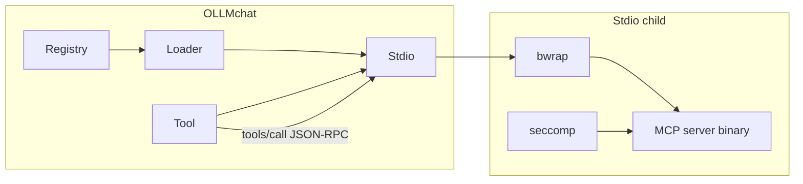

# 2.11.5. MCP Security — Sandbox, Filesystem, and Seccomp

## Overview

Security review and hardening for MCP server processes and tool execution. MCP stdio servers run as child processes controlled by OLLMchat; the agent invokes their tools via `OLLMmcp.Tool` → `Client.call()`. **Enforcement belongs in the process sandbox (bubblewrap + optional seccomp observation), not in Factory/Tool metadata** — Factory only describes tools; Tool only forwards JSON-RPC.

This plan is separate from loader/wiring work ([2.11.2](2.11.2-mcp-loader.md)–[2.11.4](2.11.4-mcp-meson-and-app-wiring.md)) so security can be reviewed and implemented without blocking core MCP integration.

Parent: [2.11-mcp-loader-tool.md](2.11-mcp-loader-tool.md)

## Status

⏳ **TODO** — Security review and implementation. Stdio has a **minimal** bwrap profile today; **no seccomp**. Align with (or share code from) `OLLMtools.RunCommand.Bubble` / `RunSeccomp` where appropriate.

## Depends on

- [2.11.3](2.11.3-mcp-clients-and-factories.md) — `Client.Stdio` spawn path exists (review target).
- Recommended after [2.11.4](2.11.4-mcp-meson-and-app-wiring.md) so MCP runs end-to-end in dev builds, but security design can start earlier.

## Related (RunCommand — reference implementation)

| Plan | Topic |
|------|--------|
| [2.11-mcp-loader-tool.md §1b](2.11-mcp-loader-tool.md) | Original MCP sandbox requirements (`network`, minimal FS) |
| [2.22.1 DONE — run_command seccomp](done/2.22.1-DONE-run-command-seccomp-network-and-path-evidence.md) | Seccomp user-notify for network/fs **evidence** (not a second enforcer) |
| [2.22.1.5 — seccomp fs appendix / bwrap setup](2.22.1.5-seccomp-fs-appendix-bwrap-namespace-setup.md) | Omit bwrap namespace-setup false positives |
| [2.6.1 DONE — sandbox space](done/2.6.1-DONE-sandbox-space-and-git-cloning.md) | Project overlay + playground binds for RunCommand |

---

## Threat model (summary)

| Actor | Capability today / target |
|-------|---------------------------|
| **MCP server process** (stdio) | Runs with host UID inside bwrap; can perform any syscall/mount not blocked by bwrap; may read most of FS (ro-bind `/`). |
| **Agent** | Chooses MCP tools and arguments; cannot directly spawn MCP — OLLMchat spawns on `fill_tools()` / session lifecycle. |
| **User** | Edits `mcp.json`; enables servers, `network`, future `allow_write` / bind lists. |
| **HTTP MCP server** | External process at `url`; OLLMchat does not sandbox the remote host — trust and TLS/local binding are the control. |

**Goals:** Limit filesystem and network exposure for stdio MCP to what each server entry needs; detect and report policy violations (seccomp notify, same philosophy as RunCommand); require explicit opt-in for network and extra write roots; honest fallback when bwrap/seccomp unavailable (Flatpak, missing `bwrap`).

**Non-goals (this plan):** Pretooler / tool filtering by risk ([2.30-pretooler-tool-filtering.md](2.30-pretooler-tool-filtering.md)); MCP server supply-chain audit; signing `mcp.json`.

---

## What controls what (Factory vs Client vs Config)

| Layer | Security role |
|-------|----------------|
| **`OLLMmcp.Config`** | Per-server policy: `enabled`, `transport`, `network`, future `allow_write` / bind roots, timeouts. User-edited `~/.config/ollmchat/mcp.json`. |
| **`Client.Stdio`** | **Enforcement:** bwrap argv, subprocess lifecycle, optional seccomp wiring. Must not duplicate policy in ad-hoc spawn paths. |
| **`Client.Http`** | No local subprocess; connect only to configured `url`. Review: localhost binding, auth, SSRF-style abuse if agent can point config at internal URLs. |
| **`OLLMmcp.Factory`** | Deserializes MCP `tools/list` metadata (`name`, `description`, `inputSchema`). **Does not** grant filesystem or network rights. |
| **`OLLMmcp.Tool`** | Dispatches `tools/call` to client. **Does not** widen sandbox; arguments are opaque JSON passed to the server inside the existing sandbox. |

Filesystem-touching MCP servers (e.g. `@modelcontextprotocol/server-filesystem` with a path argument) need **Config + bwrap binds** that match the allowed roots — not Factory changes.

---

## Current state (code audit)

### Stdio — `libocmcp/Client/Stdio.vala`

| Control | Status | Notes |
|---------|--------|--------|
| bwrap when not Flatpak and `bwrap` on PATH | ✅ | `can_use_bwrap()`, `build_argv_bwrap()` |
| `--ro-bind / /` | ✅ | Entire host FS visible read-only inside sandbox |
| `--tmpfs /tmp` | ✅ | Writable `/tmp` only |
| `--unshare-net` when `!config.network` | ✅ | Matches `Config.network` |
| `--unshare-user` | ✅ | Same as early RunCommand profile |
| Project overlay / playground | ❌ | RunCommand uses `Overlay` + project roots; MCP does not |
| `allow_write` / extra `--bind` roots | ❌ | No `Config` fields; no binds beyond `/` + `/tmp` |
| seccomp user-notify | ❌ | No `RunSeccomp` equivalent in libocmcp |
| Permission / approval UI | ❌ | `network: true` is config-only (parent plan notes prompts later) |
| Raw spawn fallback | ⚠️ | `build_argv_raw()` — full host privileges if no bwrap |
| `config.env` | ⚠️ | Passed through spawn (review: env injection, `LD_PRELOAD`, etc.) |

### HTTP — `libocmcp/Client/Http.vala`

| Control | Status | Notes |
|---------|--------|--------|
| Local process sandbox | N/A | Client is Soup HTTP to `config.url` |
| URL allowlist / block private IPs | ❌ | Not implemented |
| Auth headers / TLS | ❌ | Optional later in config |

### Config — `libocmcp/Config.vala`

| Field | Status |
|-------|--------|
| `network` (bwrap net) | ✅ |
| Writable path / bind list | ❌ |
| Per-server seccomp enable | ❌ |

---

## Target architecture (stdio)

Align MCP stdio with the **RunCommand split**:

1. **bubblewrap** — namespaces, mounts, `--unshare-net`: **enforcement**.
2. **seccomp (libseccomp user-notify)** — observe socket/connect and fs syscalls; **report** in tool/session output when policy was violated or attempted (see [2.22.1 DONE](done/2.22.1-DONE-run-command-seccomp-network-and-path-evidence.md): seccomp does not replace bwrap).



**Implementation options (pick in review):**

| Option | Pros | Cons |
|--------|------|------|
| **A. Shared sandbox module** | One bwrap+seccomp implementation; RunCommand and MCP stay consistent | Refactor `Bubble` / `RunSeccomp` out of `liboctools` (e.g. `libsandbox` or `libollmchat`) |
| **B. MCP wraps RunCommand internals** | Reuse without big move | libocmcp depends on liboctools; MCP spawn is not `/bin/sh -c` |
| **C. Duplicate adapted copy in libocmcp** | Fastest short-term | Two places to fix bugs (discouraged) |

**Recommendation:** Prefer **A** or **B** after review; document decision here before coding.

---

## Scope — work items

### 1. Security review (document findings)

- [ ] Map each default / example MCP server in docs (Chrome, filesystem, HTTP mysql) to required FS, network, and binaries.
- [ ] Compare `Stdio.build_argv_bwrap()` vs `RunCommand.Bubble.build_bubble_args()` line-by-line; list intentional deltas.
- [ ] Review `config.env` and `args` (user-controlled command lines).
- [ ] HTTP: document trust model for `url` (localhost, metadata services, credentials in URL).
- [ ] Flatpak / no-bwrap fallback: user-visible “unsandboxed MCP” warning; whether to refuse stdio MCP without bwrap.

### 2. Filesystem policy for stdio MCP

- [ ] Add config for writable roots (name TBD: `allow_write`, `binds`, or reuse RunCommand PATH-style list) — see [2.11-mcp-loader-tool.md](2.11-mcp-loader-tool.md) example `server-filesystem` with path in `args`.
- [ ] Implement `--bind` only for declared roots; keep default ro-bind `/`.
- [ ] Decide project integration: optional `ProjectManager` → overlay/project roots for MCP when server is project-scoped (may be a follow-up).
- [ ] Document that MCP server CLI paths in `args` must lie inside allowed binds or tool calls will fail at runtime.

### 3. Seccomp for MCP stdio

- [ ] Wire user-notify seccomp on bwrap spawn (same handshake pattern as `RunSeccomp.wire_launcher`).
- [ ] Network off: monitor socket/connect; network on: skip or reduce socket rules.
- [ ] Filesystem: record `openat` / write attempts outside allowed writable set; apply [2.22.1.5](2.22.1.5-seccomp-fs-appendix-bwrap-namespace-setup.md) bwrap PID filtering if shared code.
- [ ] Surface evidence to agent/user on failed or suspicious MCP tool results (format TBD: append to `tools/call` error string vs session log).

### 4. Permissions and UX

- [ ] `network: true` in mcp.json → approval prompt (mirror RunCommand `network` permission).
- [ ] Extra write roots → approval prompt (mirror `allow_write`).
- [ ] Optional: disable stdio MCP entirely when `!can_use_bwrap()` unless user confirms.

### 5. HTTP MCP (lighter pass)

- [ ] Document that security is primarily **trust config.url**.
- [ ] Optional: restrict schemes (`http`/`https` only), block link-local/metadata IPs, require `127.0.0.1` for local servers.

---

## Proposed `mcp.json` extensions (draft)

To be finalized in review — not implemented yet:

```json
{
  "id": "filesystem",
  "enabled": true,
  "transport": "stdio",
  "command": "npx",
  "args": ["-y", "@modelcontextprotocol/server-filesystem", "/home/user/projects/foo"],
  "network": false,
  "allow_write": "/home/user/projects/foo"
}
```

- **`allow_write`**: string or array of absolute directory roots → extra `bwrap --bind` pairs (same semantics as RunCommand `allow_write` where possible).
- **`network`**: already exists; keep default `false`.

---

## Out of scope (here)

- Implementing [2.11.2](2.11.2-mcp-loader.md) Loader / Tool / Registry wiring.
- Pretooler filtering of MCP tool names ([2.30](2.30-pretooler-tool-filtering.md)).
- MCP server packaging, npm supply chain, or auto-updating servers.
- Seccomp on HTTP transport (no local child).

---

## Completion criteria

- Written threat model and review notes checked into this plan (or linked bug doc).
- Stdio MCP spawn uses a documented bwrap profile with configurable write binds; default remains minimal exposure.
- Seccomp user-notify integrated for stdio MCP (or explicit decision to defer with rationale).
- Parity checklist vs RunCommand completed; known intentional differences documented.
- Manual test matrix: filesystem MCP with allowed root only; network MCP with `network: false` / `true`; Flatpak or no-bwrap fallback behaviour documented.

---

## Test plan (manual)

- [ ] stdio + bwrap + `network: false`: MCP server cannot reach network; seccomp appendix mentions attempts if server tries.
- [ ] stdio + `network: true` after approval: Chrome-style MCP can reach browser.
- [ ] stdio filesystem server: only configured `allow_write` root is writable; read outside ro-bind works; write outside fails or is reported.
- [ ] Missing bwrap: behaviour matches chosen policy (refuse vs warn vs unsandboxed).
- [ ] HTTP MCP to localhost vs invalid URL: clear errors, no local spawn.
