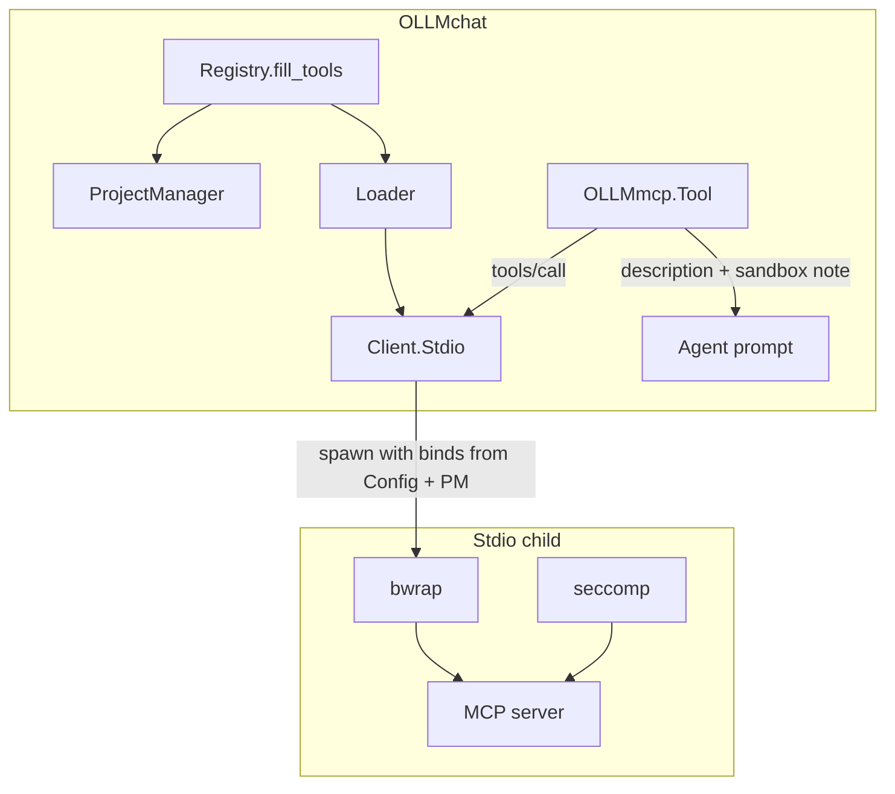

# 2.11.5. MCP Security — Sandbox, Filesystem, and Seccomp

## Overview

Security review and hardening for MCP server processes and tool execution. MCP **stdio** servers run as child processes controlled by OLLMchat; the agent invokes their tools via `OLLMmcp.Tool` → `Client.call()`. **Enforcement belongs in the process sandbox (bubblewrap + optional seccomp observation), not in Factory/Tool metadata** — Factory only describes tools from the server; Tool forwards JSON-RPC inside the sandbox already in place at spawn time.

**Design direction:** Mirror **RunCommand** filesystem and network policy for **stdio MCP only**. HTTP MCP talks to an already-running server on the host or network — OLLMchat does not sandbox that process; trust `config.url` and optional URL restrictions.

This plan is separate from loader/wiring ([2.11.2](2.11.2-DONE-mcp-loader.md)–[2.11.4](2.11.4-mcp-meson-and-app-wiring.md)) so security can be reviewed without blocking core MCP integration.

Parent: [2.11-mcp-loader-tool.md](2.11-mcp-loader-tool.md)

## Status

⏳ **TODO** — Security review and implementation. Stdio has a **minimal** bwrap profile today (`--ro-bind /`, `/tmp`, optional `--unshare-net`). **No** project overlay, **no** `allow_write` config, **no** seccomp. Align with `OLLMtools.RunCommand.Bubble` / `RunSeccomp` (shared module or dependency).

## Depends on

- [2.11.3-DONE](2.11.3-DONE-mcp-clients-and-factories.md) — `Client.Stdio` spawn path, `config.env`, `config.network`.
- Recommended after [2.11.4](2.11.4-mcp-meson-and-app-wiring.md) so MCP runs end-to-end in dev builds; filesystem/network design can proceed in parallel.

## Related (RunCommand — reference implementation)

| Plan | Topic |
|------|--------|
| [2.11-mcp-loader-tool.md §1b](2.11-mcp-loader-tool.md) | Original MCP sandbox requirements |
| [2.22.1 DONE — run_command seccomp](done/2.22.1-DONE-run-command-seccomp-network-and-path-evidence.md) | Seccomp user-notify for network/fs **evidence** |
| [2.22.1.5 — seccomp fs appendix](2.22.1.5-seccomp-fs-appendix-bwrap-namespace-setup.md) | Omit bwrap namespace-setup false positives |
| [2.6.1 DONE — sandbox space](done/2.6.1-DONE-sandbox-space-and-git-cloning.md) | Project overlay + `$HOME/playground` for RunCommand |

---

## Policy: mirror RunCommand (stdio only)

RunCommand behaviour (see `RunCommand.Tool` / `Bubble` / `Request`):

| Context | Filesystem default | Extra writes | Network |
|---------|-------------------|--------------|---------|
| **Project open** | Overlay + read-write on project roots; `$HOME/playground`; host `/` read-only unless extra roots | Agent may request `allow_write` with PATH-style absolute roots (user prompted) | Opt-in per call (`network` param) |
| **No project** | Host `/` read-only; cwd/home semantics; **must name explicit absolute roots** to get `--bind` writes | Same `allow_write` list — no implicit “project” | Opt-in per call |

**Target for stdio MCP:** Same split, but policy is **per server entry in `mcp.json`** (and session project at `fill_tools()` time), not per tool call argument.

| Context | MCP stdio target |
|---------|------------------|
| **Project open** (`Registry.fill_tools(..., project_manager)`) | Use `ProjectManager` / `Overlay` like `Bubble(project, …)` — writable project roots + playground; ro-bind `/` elsewhere |
| **No project** | No implicit project overlay; **`allow_write` in mcp.json must list absolute directory roots** (or server disabled / minimal read-only profile) |
| **Network** | `config.network` (default `false`); opt-in in JSON; later mirror permission prompt |

**Important:** Many MCP servers take a root path in **`args`** (e.g. filesystem server). That path must lie inside the **bwrap bind set** built from config + project, or tools will fail at runtime. Config and spawn must stay consistent; validating `args` against allowed roots is a review item.

**HTTP MCP:** No local child sandbox. File access and network are whatever the remote server already has. OLLMchat only controls whether we connect to `config.url`. Do **not** apply overlay/`allow_write` bwrap to HTTP transport.

---

## Informing the LLM vs enforcing policy

Two separate concerns:

| Concern | Mechanism | Applies to |
|---------|-----------|------------|
| **Enforcement** | bwrap mounts, `--unshare-net`, seccomp evidence | **stdio only** |
| **Agent guidance** | Text the model sees when choosing tools/args | stdio (and optionally HTTP disclaimers) |

**Do not inject OLLMchat policy into MCP `tools/call` arguments.** Arguments are defined by the MCP server’s `inputSchema` and must pass through unchanged to `Client.call()`.

**Do augment what the agent reads** for stdio MCP tools:

- Append to `OLLMmcp.Tool.parameter_description` and/or `description` a short **OLLMchat sandbox block**, e.g. allowed read/write roots, whether network is enabled, “paths outside these roots will fail or be reported”.
- Source: resolved policy at tool registration time (`Config` + current `ProjectManager` when `fill_tools()` ran).
- Same information style as RunCommand’s `@param allow_write` / project lines in tool docs — **documentation for the model**, not extra JSON fields on the wire.

HTTP tools may get a one-line note (“connects to configured URL; no local sandbox”) if useful; no path list.

**Registry gap today:** `fill_tools(manager, project_manager)` receives `project_manager` but `Loader.run()` does not — policy cannot be project-aware until Loader/Stdio take project context into spawn and tool registration.

---

## Threat model (summary)

| Actor | Capability today / target |
|-------|---------------------------|
| **MCP server process** (stdio) | bwrap: ro-bind `/`, writable `/tmp`, optional net; **can read most of host FS**. Target: project overlay + explicit binds only. |
| **Agent** | Chooses MCP tools and arguments; cannot spawn MCP directly. |
| **User** | Edits `mcp.json`; `network`, `allow_write`, command/args. |
| **HTTP MCP server** | External at `url`; trust boundary is URL + remote host. |

**Goals:** Stdio MCP filesystem/network parity with RunCommand; seccomp **evidence** when policy violated (warnings in tool result or session log); explicit opt-in for network and extra roots; clear behaviour when bwrap unavailable.

**Non-goals:** Pretooler ([2.30](2.30-pretooler-tool-filtering.md)); MCP supply-chain audit; signing `mcp.json`; sandboxing remote HTTP servers.

---

## What controls what

| Layer | Security role |
|-------|----------------|
| **`OLLMmcp.Config`** | Per-server policy in `mcp.json`: `network`, `allow_write` (TBD shape), command/args/env. |
| **`Registry.fill_tools` + `ProjectManager`** | Session project roots for default stdio FS policy when project open. |
| **`Client.Stdio`** | **Enforcement:** bwrap argv, overlay, seccomp; built from Config + project. |
| **`Client.Http`** | Connect only; URL trust model; no bwrap. |
| **`OLLMmcp.Factory`** | MCP `tools/list` metadata only; does not grant rights. |
| **`OLLMmcp.Tool`** | `tools/call` forwarder; **may** extend descriptions with sandbox text; does not widen sandbox per call. |

---

## Current state (code audit)

### Stdio — `libocmcp/Client/Stdio.vala`

| Control | Status | Notes |
|---------|--------|--------|
| bwrap when not Flatpak and `bwrap` on PATH | ✅ | |
| `--ro-bind / /` | ✅ | Entire host FS readable — **too permissive vs RunCommand target** |
| `--tmpfs /tmp` | ✅ | Writable `/tmp` only |
| `--unshare-net` when `!config.network` | ✅ | Default network **off** |
| `--unshare-user` | ✅ | |
| Project overlay / playground | ❌ | `Bubble` + `Overlay` not used |
| `allow_write` / extra `--bind` roots | ❌ | No `Config` fields |
| `config.env` on spawn | ✅ | `SubprocessLauncher.setenv` |
| seccomp user-notify | ❌ | |
| Permission prompts (`network`, extra roots) | ❌ | |
| Raw spawn fallback | ⚠️ | Unsandboxed if no bwrap |
| LLM sandbox text on `Tool` | ❌ | |

### HTTP — `libocmcp/Client/Http.vala`

| Control | Status | Notes |
|---------|--------|--------|
| Local sandbox | N/A | |
| URL restrictions | ❌ | |

### Config — `libocmcp/Config.vala`

| Field | Status |
|-------|--------|
| `network` | ✅ default `false` |
| `allow_write` / bind roots | ❌ |
| `env` | ✅ |

### Registry — `libocmcp/Registry.vala`

| Item | Status |
|------|--------|
| `fill_tools(..., project_manager)` | ✅ signature exists |
| Pass project into Loader / Stdio spawn | ❌ |

---

## Target architecture (stdio)

1. **bubblewrap** — namespaces, mounts, `--unshare-net`: **enforcement**.
2. **seccomp** — observe socket/fs syscalls; **report** violations (same philosophy as RunCommand; does not replace bwrap).



**Implementation options:**

| Option | Pros | Cons |
|--------|------|------|
| **A. Shared sandbox module** | One bwrap+seccomp; RunCommand and MCP stay consistent | Refactor `Bubble` / `RunSeccomp` out of `liboctools` |
| **B. MCP uses RunCommand internals** | Reuse quickly | libocmcp → liboctools; MCP argv is not `sh -c` |
| **C. Duplicate in libocmcp** | Fast | Two codepaths (discouraged) |

**Recommendation:** **A** or **B**; decide before coding.

---

## Scope — work items

### 1. Security review

- [ ] Map example servers (Chrome, filesystem, HTTP) to FS, network, binaries.
- [ ] Line-by-line: `Stdio.build_argv_bwrap()` vs `Bubble.build_bubble_args()`.
- [ ] Review `config.env`, `args` (user-controlled command line).
- [ ] Validate filesystem server paths in `args` ⊆ allowed bind roots.
- [ ] HTTP: trust model, localhost / SSRF, credentials in URL.
- [ ] Flatpak / no-bwrap: refuse vs warn vs unsandboxed.

### 2. Filesystem policy (stdio) — RunCommand parity

- [ ] Add `allow_write` to `Config` (reuse RunCommand semantics where possible):
  - `"project"` — when `project_manager` present at load: overlay + project roots + playground (default in project session).
  - `"no"` — no extra host binds beyond stdio defaults.
  - Absolute path or PATH-style list (`:` on Unix) — explicit roots; **required** when no project (or server not project-scoped).
- [ ] Wire `project_manager` from `Registry.fill_tools` → `Loader.run` → `Client.Stdio` (or shared sandbox builder).
- [ ] Build bwrap argv: overlay binds, playground, extra `--bind` from `allow_write`, keep ro-bind `/`.
- [ ] Document: `args` paths must match allowed roots.

### 3. Agent-visible policy (stdio)

- [ ] At tool registration, compute resolved roots + network flag.
- [ ] Append sandbox summary to `Tool.parameter_description` (and/or `description`); do **not** modify `tools/call` params.
- [ ] Wording aligned with RunCommand tool docs (`allow_write`, project-only writes).

### 4. Seccomp (stdio)

- [ ] Wire `RunSeccomp` (or shared equivalent) on bwrap spawn.
- [ ] Network off: socket/connect evidence; network on: reduced rules.
- [ ] FS: evidence for access outside writable set; [2.22.1.5](2.22.1.5-seccomp-fs-appendix-bwrap-namespace-setup.md) PID filtering.
- [ ] Surface evidence on failed/suspicious MCP tool results (append to error string and/or session log).

### 5. Permissions and UX

- [ ] `network: true` → approval prompt (mirror RunCommand).
- [ ] Extra `allow_write` roots beyond project default → approval prompt.
- [ ] Optional: refuse stdio MCP without bwrap unless user confirms.

### 6. HTTP MCP (lighter)

- [ ] Document: no local sandbox; trust `url`.
- [ ] Optional: scheme allowlist, block metadata IPs, localhost-only mode.

---

## Proposed `mcp.json` (draft)

```json
[
  {
    "id": "filesystem",
    "enabled": true,
    "transport": "stdio",
    "command": "npx",
    "args": ["-y", "@modelcontextprotocol/server-filesystem", "/home/user/projects/foo"],
    "network": false,
    "allow_write": "/home/user/projects/foo"
  },
  {
    "id": "chrome",
    "enabled": true,
    "transport": "stdio",
    "command": "npx",
    "args": ["-y", "@modelcontextprotocol/server-chrome"],
    "network": true,
    "allow_write": "no"
  },
  {
    "id": "mysql",
    "enabled": true,
    "transport": "http",
    "url": "http://127.0.0.1:3000"
  }
]
```

| Field | Transport | Meaning |
|-------|-----------|---------|
| `network` | stdio | `true` → omit `--unshare-net` (default `false`) |
| `allow_write` | stdio | `"project"` \| `"no"` \| absolute path(s) — bwrap binds; see policy table above |
| `args` | stdio | Server CLI; paths should ⊆ `allow_write` / project roots |
| `url` | http | Trust boundary only |

When a **project is open**, default for omitted `allow_write` may be `"project"` (match RunCommand). When **no project**, default is **no** extra writes unless explicit paths in config.

---

## Out of scope

- [2.11.2](2.11.2-DONE-mcp-loader.md)–[2.11.3](2.11.3-DONE-mcp-clients-and-factories.md) core loader/clients (done).
- Pretooler ([2.30](2.30-pretooler-tool-filtering.md)).
- Seccomp on HTTP (no local child).
- Rewriting MCP server `inputSchema` from OLLMchat.

---

## Completion criteria

- Threat model and RunCommand parity checklist documented.
- Stdio spawn uses project-aware overlay + configurable `allow_write`; default ro-bind `/` with minimal writable set.
- `project_manager` threaded through load/spawn.
- Agent sees sandbox summary on stdio MCP tools; `tools/call` args unchanged.
- Seccomp evidence integrated or deferral documented.
- Manual test matrix below passed or gaps listed.

---

## Test plan (manual)

- [ ] stdio + project + default `allow_write`: MCP can read/write project roots and playground; not write arbitrary host paths.
- [ ] stdio + no project + explicit `allow_write` paths: only listed roots writable.
- [ ] stdio + no project + no paths: writes outside `/tmp` fail or seccomp reports.
- [ ] stdio `network: false` / `true` (with approval).
- [ ] stdio filesystem server: `args` root inside binds; tool call outside root fails with clear message.
- [ ] Agent tool description includes allowed roots (stdio).
- [ ] HTTP MCP: no local spawn; connection errors only.
- [ ] Missing bwrap: policy matches decision (refuse / warn / unsandboxed).
