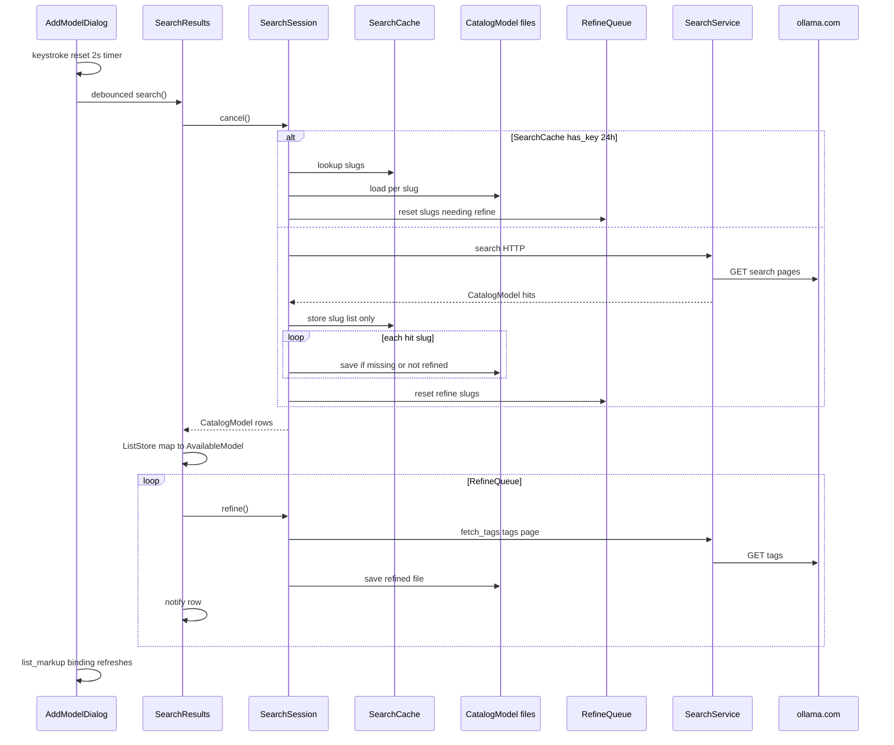

# 4.8 — Ollama.com live model search (`libollamaweb`)

**Status:** ✅ **Phase 1 complete** — `libollamaweb` + offline `ollamaweb` tests; ✅ **Phase 2.1** (**4.8.1**); **Phase 2.2** not started

**Layout:** `docs/guide-to-writing-plans.md`

**Coding standards:** `docs/coding-standards.md` — implementers must satisfy the **Checklist for all plans** (nullable avoidance, `this.`, `GLib.*`, multiline docblocks, no `@"` interpolation, etc.). Verify against that checklist before marking implementation complete.

---

## Purpose

- **🔷** Replace **Add Model** search that filters a **large bundled** `resources/ollama-models.json` with **live HTTP search** against [ollama.com](https://ollama.com/search).
- **🔷** Implement scraping/parsing in a **new library** `libollamaweb` — **not** inside `libollmchat` / `ollmapp`.
- **🔷** Main app code only **starts searches** and **consumes async results** (debounced UI → library → `ListModel`).
- **🔷** **Search pages are shallow** (name, slug, blurb, maybe pulls) — **sizes/tags/features** come from the **detail** flow (tags HTML or **cached** JSON), same as PHP after `parseSearchResults`.
- **🔷** **Model detail** lives in a **directory of per-slug JSON files** under `SearchSession.model_dir`; files appear from **live search** and **refine**, not from loading `ollama-models.json` in `libollamaweb`.
- **🔷** **Search results** are cached **in memory only** as **slug lists** (same query + category + sorts → no search HTTP for up to **one day**); row data comes from the **per-slug model directory** on disk.
- **🔷** Typing debounce ~**2 seconds** between live searches; **cancel** in-flight search and detail work when the query changes.

**ℹ️** Today: `docs/tools/fetch_ollama.php` mirrors ollama.com into JSON; `AvailableModels.load()` reads the GResource + optional `data_dir/ollama-models.json`; `AddModelDialog` uses `Gtk.StringFilter` on **name** only (`ollmapp/SettingsDialog/AddModelDialog.vala`).

---

## Scope

| In scope | Out of scope |
|----------|----------------|
| New **`libollamaweb`**: HTTP GET, HTML parse of **search result pages**, merge/dedupe, category filters | Rewriting **`fetch_ollama.php`** (stays for bulk JSON / dev refresh) |
| **Phase 2.1** `AddModelDialog`: live `q=` search replaces bundled JSON filter (debounce, refine, pull) | Changing **pull** / **ConnectionModels** behaviour |
| **Phase 2.2** category chips, enriched row UI, rate-limit messaging | |
| **Progressive detail** enrichment (cache → else tags fetch) for hits in the current result set | Full parity with PHP **derivative** crawl (top-50 popular, minimax pass, etc.) |
| **`OllamaWeb.SearchSession`**: search cache (slug lists), **`CatalogModel on disk`** (catalog directory), **`RefineQueue`** | Disk cache of **search HTML** pages; runtime load of one giant `ollama-models.json` |
| **Phase 2.1 `SearchResults`**: `ListModel` of `OllamaWeb.Model`, debounce (**4.8.1**) | `AvailableModel` / bundled JSON in Add Model |
| **`CatalogModel on disk`**: one `{slug}.json` under `data_dir` for shallow hits + live-refined detail | Loading entire bundled JSON into RAM on every dialog open |
| Cancel **detail enrichment** when a new search supersedes the current result set | |
| **Fixture-based tests** (no live ollama.com in CI) | Network integration tests against ollama.com in default `meson test` |

---

## Acceptance criteria

### Phase 1 (library only)

- [x] **✅** `libollamaweb` builds standalone; **zero** link dependency on `libollmchat` / `ollmapp`.
- [x] **✅** `OllamaWeb.Model` + `OllamaWeb.ModelVariant` (`Json.Serializable`; field **`tags`**; includes **`slug`**, **`refined`**).
- [x] **✅** Fixture suite **`ollamaweb`** passes without network (`meson test --suite ollamaweb`).
- [x] **✅** `OllamaWeb.Search.Parser`, `Client`, `Service`, `Cache`, `Session` (see **Two stores** below).
- [x] **✅** **RAM search cache** (`OllamaWeb.Search.Cache`): 24 h TTL slug lists keyed by `(query, category, sorts)`; cache hit → no search HTTP (`Session.search` → `Model.load` per slug).
- [x] **✅** **Per-slug disk** (`Model.load` / `save` / `exists` under `Session.model_dir`).
- [x] **✅** **`refine_queue`** + `Session.refine()` (tags fetch; `refined` + `save`).
- [x] **✅** **Double search (Phase 1, required):** for every **non-empty** `query`, `Service.search` / `Session.search` fetch **both** `search?q=…` (popular order) **and** `search?q=…&o=newest`, then **`merge_double_search`** (dedupe by slug; **popular row wins**, newest only adds slugs missing from popular). Callers pass **`query` + `category` only** — no sort list parameter.
- [x] **✅** **No empty-query search** (`query.strip() == ""` → no HTTP; no browse `/search` at runtime).
- [x] **✅** **`Category`** enum + `c=` on search URLs (library; UI chips are **Phase 2.2**).
- [x] **✅** **Cancel / busy** in library: `Session.cancel()`, `cancel_search()` before new search, `searching` / `enriching` / `busy`; shallow search does not overwrite `refined` on-disk rows.
- [x] **✅** CODING_STANDARDS checklist satisfied for `libollamaweb` Vala (`var` locals, `GLib.*`, no empty-query search, public collections on `Cache` / `refine_queue`).
- [x] **✅** Offline **double-search merge** test: `test-ollamaweb-merge.sh` + `search-double-merge.expected.json` (`Service.merge_double_search` on popular + newest fixtures).

### Phase 2.1 — basic integration (replace bundled Add Model search)

**🔷** Ship this first: typed **`q=`** live search instead of filtering `ollama-models.json`. **`Category.NONE`** only; keep existing pulldown sorter. Double search + RAM/disk cache come from Phase 1 `Session` (caller passes non-empty `query` + `category`).

**ℹ️ Implementation spec:** [`docs/plans/4.8.1-ollama-web-phase-2-1-add-model.md`](4.8.1-ollama-web-phase-2-1-add-model.md)

- [ ] **⏳** Phase 2.1 in **4.8.1**: delete `AvailableModel` / `ModelTag` / `AvailableModels`; catalog + markup on `OllamaWeb.Model`; `SearchResults` + `AddModelDialog`.
- [ ] **⏳** **Non-empty query only:** pulldown → debounced **`Session.search(query, Category.NONE)`** (no browse-on-open).
- [ ] **⏳** **~2 s debounce** before `Session.search` (UI only).
- [ ] **⏳** **Cancel:** new keystroke / dialog close → **`Session.cancel()`**; prior search HTTP aborted (library already cancels on new `Session.search`).
- [ ] **⏳** **Refine:** after each search, **`Session.refine.begin()`** while `refine_queue` non-empty (background).
- [ ] **⏳** **Shallow rows** show immediately; **pull** works when tags exist (from disk refine or prior cache).
- [x] **✅** **Removed** `AvailableModels` / `AvailableModel` / `ModelTag` from app (**4.8.1**); bundled JSON unused by Add Model.
- [ ] **⏳** Integration Vala matches **CODING_STANDARDS.md**.

### Phase 2.2 — advanced integration (filters + UX polish)

**🔷** After 2.1 works end-to-end. Library already supports `Category` and `c=` URLs.

- [ ] **⏳** **Category chips** in Add Model (embedding, vision, tools, thinking) → pass `OllamaWeb.Search.Category` into `Session.search`.
- [ ] **⏳** **Row refresh** when `refine()` completes: `OllamaWeb.Model` **`notify("list_markup")`** (and size dropdown) without replacing store items.
- [ ] **⏳** **Loading UX:** “Searching…” when store empty + `busy`; optional per-row “loading sizes…” until tags arrive.
- [ ] **⏳** **Download guard:** row selected with empty `tag_objects` waits for in-flight refine or blocks pull until tags exist.
- [ ] **⏳** **HTTP 429/503** non-fatal message in dialog (map `OllamaWeb.Search.Error.RATE_LIMITED`).
- [ ] **⏳** Optional **`row_enriched`** (or equivalent) signal from `SearchResults` for UI bindings.

---

## Ollama.com URLs (from `fetch_ollama.php`)

**ℹ️** Base: `https://ollama.com/search`

| Use | URL |
|-----|-----|
| Popular browse | `/search` — **fixtures / parser tests only** (not used at runtime; no empty-query search) |
| Newest browse | `/search?o=newest` — **fixtures / parser tests only** |
| Text search | `/search?q={query}` — **runtime** (required non-empty `query`) |
| Category (popular) | `/search?c=embedding` \| `vision` \| `tools` \| `thinking` |
| Category (newest) | above + `&o=newest` |
| Tags / sizes (detail) | `/library/{slug}/tags` or `/{author}/{model}/tags` if slug contains `/` |

**🔷 Double search (Phase 1 library — implemented in `Service.search`):** for non-empty `query`, always two GETs per search: **`search?q=…`** + **`search?q=…&o=newest`** (and same with `&c=` when category set). Merge by slug. **Verify** live site returns distinct order; if not, drop second request in code.

**🔷** User types a model name → encoded **`q=`** as above. **Not** integration work.

**🚫** **No empty-query search** — do not call the library with `query == ""` to populate the Add Model pulldown on open. Browse URLs in the table above are for **offline fixtures** only.

---

## HTML parsing rules (port from PHP)

**ℹ️** Source: `parseSearchResults()` and `parseDerivativeSearch()` in `docs/tools/fetch_ollama.php`.

### Search result list

- Container: `//*[@id="searchresults"]/ul/li` (fallback: `//ul[contains(@class,"divide-y")]/li`).
- Per row:
  - **slug** from anchor `href`:
    - `/library/(.+?)(?:/tags|$)`
    - or `/author/model` (two segments; exclude `signin`, `download`, `docs`, `search`, `tags`, etc.)
  - **name**: `.//div[1]/h2/span` then `.//h2/span`
  - **description**: `.//div[1]/p` then `.//p`
  - **pulls** (optional, derivative-style rows): `.//div[2]/p/span[1]/span[1]` — parse `1.2M` / `50K` like PHP `extractDownloads`.

### Dedupe / merge

- Key: **slug** (namespaced `author/model` allowed).
- When duplicate slug from two requests: keep the **popular** row; newest only supplies slugs not in popular.
- Sort for UI (keep current `AddModelDialog` sorter behaviour): prefix match → contains → alphabetical.

### Tags page (detail extraction — cache miss)

- Port `extractTags()`, `extractFeatures()`, `extractDownloads()` from same PHP file.
- Table: `//div[contains(@class,"min-w-full") and contains(@class,"divide-y")]`.
- Rows: tag **name** from `href` (`/library/...:tag` or `/author/model:tag`); **size**, **context**, **input** from three `col-span-2 text-neutral-500` nodes.
- Features: `bg-indigo-50` spans → `tools`, `thinking`, etc. (map to `AvailableModel.features` icons already in `AvailableModel.list_markup`).

**🚫** Do **not** port PHP **Step 5** derivative crawl (per-model `search?q=` for top 50) into v1 — live `q=` search covers user intent.

**ℹ️** PHP **sub-searches** (`search?q={modelName}` for derivatives) are a separate discovery path; v1 only needs **`/tags`** (or cached JSON) for **size variants**, not derivative list expansion in the Add Model dialog.

---

## Two stores (+ refine queue)

**ℹ️** All model **data** is **one `Model` per file** under `Session.model_dir`. Disk I/O is `Model.load` / `save` — no separate store class. Phase **2.1** **`SearchResults`** owns GTK `ListStore`, debounce, and mapping to `AvailableModel`.

### A — Search results cache (`OllamaWeb.SearchCache`, **RAM only**)

**🔷** Key: normalized **`(query, category, sorts[])`** (sorts included when merging popular + newest).

| Property | Value |
|----------|--------|
| Storage | **`string[]` slugs only** — not `CatalogModel`, not HTML |
| TTL | **24 hours** from `store()` |
| API | `has_key()` then `lookup()` → slug array; `store(..., slugs)` after HTTP |
| Behaviour | Cache hit → `CatalogModel.load(model_dir, slug)` per slug; **no** ollama.com search HTTP |
| Invalidation | TTL expiry; `clear()` on dialog destroy (optional) |

**🚫** Do **not** persist search pages or full hit JSON in this cache.

### B — Model catalog directory (`SearchSession.model_dir`, **disk**)

**🔷** The catalog **is** a directory: one `{slug}.json` per model (`/` → `__` in the filename).

| When | Action |
|------|--------|
| Search HTTP | `save(dir)` with `refined = false` if no file or existing file not refined; **do not** overwrite **refined** files |
| After `refine()` | same object, `refined = true`, `save(dir)` |
| Resolve row | `exists` + `load(dir, slug)`, else empty stub |

**ℹ️** `resources/ollama-models.json` stays for **today's** `AvailableModels` path until Phase 2; **`libollamaweb` does not read or split that file**.

**🚫** Do **not** add array-import helpers in the library — no legacy bootstrap in `libollamaweb`.

### C — Refinement queue (`OllamaWeb.RefineQueue`, **RAM only**)

**🔷** In-memory slug list for the **current search generation** only.

| Property | Value |
|----------|--------|
| Reset | On each `SearchSession.search()` (cache hit or HTTP): slugs where `CatalogModel.refined` is false |
| Drain | `SearchSession.refine()` — background worker; not a second copy of models in the library |
| Cancel | `SearchSession.cancel()` clears queue and aborts enrichment `GLib.Cancellable` |

**ℹ️** Phase 2 may run `refine` from a worker thread / idle handler with bounded concurrency; queue holds **slugs**, not `CatalogModel` graphs.

---

## Progressive enrichment + cancel on query change

**🔷** Search pages are shallow; user sees results **immediately**; detail fills in on the **same** row objects.

### After a search (cache miss or hit)

1. `SearchSession.search()` returns `CatalogModel[]` (one `load()` per slug from `CatalogModel on disk`).
2. Phase 2.1: populate `ListStore` with mapped `AvailableModel` rows.
3. `refine_queue` lists slugs still needing tags; call **`refine()`** (bounded concurrency in app, e.g. 3–5).

### When the user narrows the query (e.g. `ge` → `gemini`)

1. **Debounce ~2 s** — no new search HTTP until idle interval elapses.
2. On **new** search starting:
   - **`cancel()`** the previous search `GLib.Cancellable` (Soup abort).
   - **`cancel()`** the **enrichment** cancellable for the **previous** result generation.
   - Drop in-flight detail work for slugs **not** in the new hit list (ignore late completions if cancelled).
3. Run new search (or serve from **`SearchCache`** if key still fresh).
4. Replace store contents; start enrichment **only** for the new slug set.

**ℹ️** Example: typing `ge` finds Gemini variants and starts detail for them; user adds `mmi` → `gemini` → old detail jobs for rows that dropped off the list are **cancelled**; enrichment restarts for the narrower list (JSON hits are instant, misses fetch again).

### Row selected before tags ready

- Await that slug’s enrichment if still in the **current** generation; else start fetch (if not cancelled).

**🚫** Do **not** copy search hits into a second list — one `ListStore`, same `AvailableModel` instances, in-place updates + `notify`.

---

## UI list model: one store, same objects, in-place updates

**🔷** The dialog (or a small coordinator in `libollmchat`) exposes **one** `GLib.ListStore` of `AvailableModel` wired into the existing chain:

`ListStore` → `Gtk.SortListModel` → `Gtk.SingleSelection` → `SearchablePulldown`

### Search cycle

1. User types / changes category → wait **~2 s** debounce (reset timer on each key).
2. **`cancel()`** prior search + enrichment generation (`GLib.Cancellable`).
3. If **`SearchCache.has_key`** → slug list + rebuild models; else `SearchSession.search()` HTTP.
4. Coordinator **`remove_all()`**, **`append()`** one **`AvailableModel`** per `CatalogModel` (refined rows load tags from disk).
5. Drain **`RefineQueue`** via `refine()` for slugs still missing tags (respect enrichment cancellable).

### Updating rows (no copy)

- Hold **one** `AvailableModel` per slug in the store for that search generation.
- Enrichment **mutates** that instance (`tag_objects`, `features`, `downloads`, then `update_unique_sizes()`).
- UI already binds row label to **`list_markup`** (`AddModelDialog` factory) — after mutation, emit GObject **`notify`** on properties that feed markup (e.g. `tags`, `features`, `downloads`, and **`list_markup`** if needed).
- **ℹ️** `GLib.ListStore` does **not** re-read row content when a child property changes; **property `notify` + bindings** is the right mechanism (same object identity → no `items_changed` required for a chip update).
- **💩** If a GTK version/list view fails to refresh, **`items_changed(i, 1, 1)`** at index `i` is an acceptable hammer (replace same pointer at index).

**🚫** Do **not** “monitor search results and copy into live data” as two parallel arrays — search hits should **become** store rows once, then only **enrich** those rows.

### Library coordinator (`libollamaweb`, **implemented**)

| Class | Role |
|-------|------|
| `SearchSession` | `search()`, `refine()`, `cancel()`; owns `SearchCache`, `CatalogModel on disk`, `RefineQueue` |
| `SearchCache` | 24 h RAM **slug lists** per search key |
| `CatalogModel` | `load` / `save` / `exists` on per-slug files under `model_dir` |
| `RefineQueue` | RAM slug queue for current result set |
| `SearchService` | HTTP + parser only (no TTL cache) |

### Activity + cancel API (`SearchSession`)

**🔷** UI can show spinner / disable actions while work runs.

| Member | Meaning |
|--------|---------|
| `bool searching` | from `SearchService` (HTTP search in flight) |
| `bool enriching` | `refine()` running |
| `bool busy` | `searching \|\| enriching` |
| `void cancel()` | abort search + enrichment; `refine_queue.clear()` |
| `RefineQueue refine_queue` | slugs awaiting tags fetch (read `size` for UI) |

**ℹ️** `SearchService` / `SearchSession` methods take `GLib.Cancellable?` for caller wiring; session owns internal cancellables for cancel-on-new-search.

### Phase 2 app layer (`libollmchat`, **2.1 / 2.2 not implemented**)

| Class | Phase | Role |
|-------|-------|------|
| `SearchResults` | **2.1** | `ListStore`; **~2 s debounce**; owns `OllamaWeb.Search.Session`; maps `Model` → `AvailableModel`; `search` / `refine` / `cancel` |
| `AddModelDialog` | **2.1** | Pulldown backed by `SearchResults` instead of static `AvailableModels` filter |
| `AddModelDialog` | **2.2** | Category chips → `Category` on `Session.search`; loading + rate-limit UI |
| `AvailableModel` | **2.2** | `notify` after enrichment so list rows update in place |

**ℹ️** Set `session.model_dir` under `data_dir`; per-slug files appear as the user searches and refines.

---

## Implementation phases

### Phase 1 — standalone `libollamaweb` + tests (**no main app wiring**)

**🔷** Deliver and review **before** any `libollmchat` / `ollmapp` integration.

| In Phase 1 | Not in Phase 1 |
|------------|----------------|
| `libollamaweb/` meson subdir, builds **`libollamaweb.so`** alone | `subdir` from `libollmchat` or `ollmapp` depending on ollamaweb |
| **`Model`**, **`ModelVariant`**, `Search/*` (`Parser`, `Client`, `Service`, `Cache`, `Session`) | `SearchResults`, `AddModelDialog` changes |
| RAM **`Cache`**, per-slug **`Model` on disk**, **`refine_queue`**, cancel/busy on **`Session`** | Live-site test in default CI |
| `tests/data/ollamaweb/` fixtures + suite **`ollamaweb`** | `Session` integration tests (💩 optional) |
| `examples/oc-test-ollamaweb` (fixture CLI) | |

**ℹ️** Phase 1 tests call **`SearchParser`** with fixture HTML only (no Soup). **`SearchSession`** / disk store tests are optional follow-up.

**🔷** Phase 1 is **complete** (`meson test --suite ollamaweb`). Next: **Phase 2.1**.

### Phase 2.1 — basic integration (wire live search into Add Model)

| In 2.1 | Not in 2.1 (→ 2.2) |
|--------|---------------------|
| `libollmchat` → `libollamaweb`; `SearchResults`; `AddModelDialog` pulldown | Category filter chips |
| Debounced `Session.search(q, Category.NONE, [])` | `row_enriched` / loading line polish |
| `Session.refine`, `cancel`, `model_dir` | 429/503 banner |
| Map `Model` → `AvailableModel`; existing `CustomSorter` | Download wait when tags empty |

### Phase 2.2 — advanced integration (filters + polish)

- Category chips → `Session.search(..., category, ...)`.
- In-place row updates after refine; searching / rate-limit UX.
- Stricter download when tags not ready.

---

## Library design: `libollamaweb`

**🔷** Namespace: **`OllamaWeb`** (package `libollamaweb`, soname `ollamaweb`).

### Dependencies

- `libsoup-3.0` — async GET (same pattern as `liboctools/WebFetch/Request.vala`).
- `libxml-2.0` — parse HTML (Vala bindings).
- `gee-0.8`, `gio-2.0`, `glib-2.0`.

**🚫** No dependency on `libollmchat`, GTK, or Pango.

### Reuse: existing model types in `libollmchat`

**ℹ️** The app already has catalog types aligned with `ollama-models.json`:

| Existing class | File | Data fields (JSON-shaped) |
|----------------|------|-----------------------------|
| **`OLLMchat.Settings.ModelTag`** | `libollmchat/Settings/ModelTag.vala` | `name`, `size`, `context`, `input` |
| **`OLLMchat.Settings.AvailableModel`** | `libollmchat/Settings/AvailableModel.vala` | `name`, `description`, `tags` / `tag_objects`, `features`, `downloads` |

**ℹ️** JSON also has **`slug`** (and derivatives use namespaced slugs); **`AvailableModel` does not declare `slug` today** — the copied library type **should** include `slug` as the stable key.

**ℹ️** Phase **2.1** (**4.8.1**) moves `list_markup`, `unique_sizes`, and variant dropdown helpers onto **`OllamaWeb.Model`** / **`ModelVariant`** and **deletes** the `libollmchat` duplicates.

### Public types in `libollamaweb` (copy data layer, rename namespace)

**🔷** **Phase 1** copies the **data** shape into namespace **`OllamaWeb`** (new files under `libollamaweb/`, not a link dependency on `libollmchat`):

| New type | Based on | Fields / notes |
|----------|----------|----------------|
| `OllamaWeb.ModelVariant` | `ModelTag` | `name`, `size`, `context`, `input`; optional `parse_size_gb()` if tests need it |
| `OllamaWeb.CatalogModel` | `AvailableModel` (data only) | same fields everywhere; **`refined`** flag (false after search parse, true after tags / full JSON) |
| `SearchCategory` | (new enum) | `NONE`, `EMBEDDING`, `VISION`, `TOOLS`, `THINKING` |
| `SearchSort` | (new enum) | `POPULAR`, `NEWEST` |

**ℹ️** Parser fills **`CatalogModel`** stubs from search HTML (shallow: slug, name, description, optional pulls on row); **`apply_tags`** fills `tags` / `features` / `downloads`.

**🔷** `Json.Serializable` on `CatalogModel` / `ModelVariant`; `CatalogModel.pretty_json()` for fixture CLI output.

**🚫** Do **not** introduce parallel `SearchHit` / `TagRow` DTOs — one object graph end-to-end.

| Type | Role |
|------|------|
| `Client` | `Soup.Session`, User-Agent (match PHP) |
| `SearchParser` | `parse_search`, `apply_tags` (`Html.Doc` + XPath) |
| `SearchService` | `async search(...)` ; `async fetch_tags(model, ...)` |
| `SearchCache` | RAM slug lists, 24 h TTL, `has_key` / `lookup` / `store` |
| `CatalogModel` | static `load` / `save` / `exists`; instance `refined` |
| `RefineQueue` | RAM slugs pending tags fetch |
| `SearchSession` | Orchestrates search → store slugs → resolve rows → reset queue → `refine` |

### `SearchService.search` behaviour

```
Inputs:
  query: string (must be non-empty after strip — otherwise return [] / no HTTP)
  category: SearchCategory

Build exactly two URLs (only when query.strip() != ""):
  popular: base + (no &o=)
  newest:  base + "&o=newest"
  base = "/search?q=" + encode(query) + optional "&c=..." when category != NONE

GET popular → parse
GET newest  → parse
merge_double_search(popular, newest) → return array
```

**🚫** No branch for `query == ""` (no `/search` or `/search?o=newest` at runtime).

**🔷** **24 h** search cache is **`OllamaWeb.SearchCache`** (slug strings only). HTTP stays in **`SearchService`**.

### Errors

- Map Soup status **429**, **503** → `OllamaWebError.RATE_LIMITED`.
- **404** on tags page → `OllamaWebError.NOT_FOUND` (bad slug).
- Parse zero rows on 200 → empty list + debug log (site markup change).

---

## App integration

### Meson

- **Phase 1:** Add `subdir('libollamaweb')` early (e.g. after `libocmarkdown`); **do not** add `ollamaweb` to `libollmchat` deps until Phase 2.
- **Phase 2:** `libollmchat` / `ollmapp` depend on `ollamaweb` vapi.

### `AddModelDialog` (primary UI)

#### Phase 2.1 — basic (replace bundled search)

**Remove (conceptual):**

- Eager `yield available_models.load()` of the **full** catalog **for Add Model search**.
- `Gtk.StringFilter` on static `available_models` as the **only** pulldown data source.

**Add:**

- `SearchResults` — `setup_model_chain()` uses **`search_results`’s `ListStore`** instead of `AvailableModels`.
- `search_changed` (non-empty text only) → **~2 s** debounce → `search_results.search.begin(query)` with **`Category.NONE`**.
- Dialog close → `search_results.cancel()`.
- **item_selected** → `update_size_dropdown()` / **pull** when `tag_objects` already populated (from refine or disk).

#### Phase 2.2 — advanced (filters + polish)

**Add:**

- Category chips → `OllamaWeb.Search.Category` on `Session.search`.
- Busy / “Searching…” / **429** messaging; optional per-row loading until tags arrive.
- **item_selected** when tags still empty: wait for refine or disable download until ready (`row_enriched` or equivalent).

### `AvailableModels` / bundled JSON

**🔷** Phase 2.1 switches **Add Model** to live search; bundled JSON may remain elsewhere until fully retired. **`libollamaweb` only uses `model_dir` files from HTTP**.

**🚫** Do not delete `fetch_ollama.php` or stop generating `resources/ollama-models.json` for dev/QA — that is separate from this library's per-slug directory.

---

## Flow (mermaid)



---

## Concrete code proposals (sketch)

### 1. `libollamaweb/meson.build` — new shared library (Phase 1)

#### Add

- `library('ollamaweb', sources: …, SearchCache.vala, RefineQueue.vala, SearchSession.vala)`.
- `vala_vapi: 'ollamaweb.vapi'` — consumed by tests / `oc-test-ollamaweb-parse` only until Phase 2.

### 2. `libollamaweb/CatalogModel.vala` + `ModelVariant.vala` — copy from settings types

#### Add

- Data fields matching `ollama-models.json` + **`slug`**; **no** Pango / GTK markup properties.
- **ℹ️** Source of truth for the copy: `libollmchat/Settings/AvailableModel.vala`, `ModelTag.vala`.

### 3. `libollamaweb/SearchParser.vala` — port PHP XPath (Phase 1)

#### Add

- `CatalogModel[] parse_search(string html)` — shallow search rows.
- `void apply_tags(CatalogModel model, string html)` — fills tags / features / downloads.
- Callable from tests with **file contents only** (no HTTP).

### 4. `tests/data/ollamaweb/` — HTML fixtures + golden JSON (Phase 1)

#### Add

- Committed HTML samples (search + tags) and matching `*.expected.json` files per **Tests** section.
- `README.md` for refresh instructions.

### 5. `examples/oc-test-ollamaweb-parse` + `tests/test-ollamaweb-parse.sh` (Phase 1)

#### Add

- Parse fixture → stdout JSON; shell test compares to golden files; wired in `tests/meson.build`.

### 6. `libollmchat/Settings/SearchResults.vala` — GTK coordinator (**Phase 2.1**)

#### Add

- Owns `OllamaWeb.Search.Session`; set `model_dir`.
- `ListStore`; `async search(query)` → `Session.search(query, Category.NONE, [])` after debounce.
- `refine.begin()` when `refine_queue.size > 0`; forward `searching` / `enriching` / `busy`; `cancel()` on new query / dialog close.

### 7. `ollmapp/SettingsDialog/AddModelDialog.vala` — basic live search (**Phase 2.1**)

#### Keep

- `SearchablePulldown`, `CustomSorter`, size dropdown / `ModelTag` sorting, `pull_manager.start_pull`.

#### Replace with (conceptual)

- `SearchResults` replaces `AvailableModels` as pulldown `ListModel` (non-empty search only).

### 8. Advanced UI (**Phase 2.2**)

#### Add (`AddModelDialog` + `AvailableModel`)

- Category chips → `Session.search(..., category, ...)`.
- After enrichment, **`notify("list_markup")`** on `AvailableModel`.
- Loading / 429 UX; download guard when tags not ready.

---

## Risks / ops

- **⚠️** ollama.com HTML changes break parser — refresh fixtures when markup shifts; fixture tests fail until parser or snapshots updated.
- **⚠️** Rate limits — **~2 s** debounce, cancel stale search + detail, show message on 429.
- **ℹ️** TLS / corporate proxy issues are environmental (same as other Soup clients).

---

## Tests (fixture-based, no live site in CI)

**🔷** Automated tests must **not** depend on ollama.com being reachable. They read **checked-in HTML** captured from real pages (same markup `fetch_ollama.php` caches under `~/.local/share/ollmchat/fetch_ollama/`).

### Fixture layout

Directory: **`tests/data/ollamaweb/`** (committed to git).

| File (example name) | Source URL (when refreshing) | Exercises |
|---------------------|------------------------------|-----------|
| `search-q-gemini.html` | `https://ollama.com/search?q=gemini` | Text search parse, slug/name/description, **pulls** on rows |
| `search-popular.html` | `https://ollama.com/search` | Browse / popular list |
| `search-newest.html` | `https://ollama.com/search?o=newest` | Newest ordering merge |
| `search-c-embedding.html` | `https://ollama.com/search?c=embedding` | Category filter parse |
| `tags-library-gemma3.html` | `https://ollama.com/library/gemma3/tags` | Base model tags, features, downloads |
| `tags-derivative-sample.html` | `https://ollama.com/{author}/{model}/tags` | Namespaced slug, tag table parse |

**ℹ️** Add `tests/data/ollamaweb/README.md` with:
- How fixtures were produced (copy from PHP scraper cache, or `curl` + browser UA).
- **Do not** run refresh in CI; optional maintainer script **`docs/tools/snapshot_ollamaweb_fixtures.sh`** (💩) documented separately.

### Expected outputs (golden)

**💩** Store small **JSON** sidecars next to each HTML file, e.g. `search-q-gemini.expected.json` — array of `{ slug, name, description, pulls }` — so tests compare parser output to a stable snapshot without re-parsing by hand.

For tags fixtures: `tags-library-gemini3.expected.json` — `{ tags: [...], features: [...], downloads }`.

### Test executables / meson

| Piece | Role |
|-------|------|
| **`examples/oc-test-ollamaweb`** | CLI: parse HTML, `--merge` (double-search), `--tags`, `--write-golden` |
| **`tests/test-ollamaweb-parse.sh`** | Each `*.html` vs `*.expected.json` |
| **`tests/test-ollamaweb-merge.sh`** | `search-popular.html` + `search-newest.html` → `search-double-merge.expected.json` |
| **`tests/meson.build`** | Suite **`ollamaweb`**, **no network** |

**🔷** `SearchParser` (or package-private parse entry) must accept **`string html`** (and optional base URL for relative links) so tests never call Soup.

**💩** Optional second binary **`oc-test-ollamaweb-live`** (manual only, not in default `meson test`) for developers to hit the real site — **🚫** not required for plan acceptance.

### Coordinator / cache tests

**💩** Optional Vala tests for `SearchSession` / `CatalogModel on disk` / `SearchCache` using:
- Tiny per-slug JSON fixtures under a temp `model_dir` (💩 optional).
- Temp `model_dir`; assert shallow file written on search miss.
- **No** GTK required; `SearchResults` debounce/cancel remains **manual** until Phase 2.

---

## Test plan

### Automated (CI)

- [x] **✅** `meson test -C build --suite ollamaweb` passes offline (all HTML fixtures vs `.expected.json`).
- [ ] **⏳** Parser tests cover at least: search with **q=**, popular, newest, **embedding** category, library **tags**, derivative **tags**.

### Manual (UI / live)

- [ ] **⏳** UI: search `gemini`, pick model, sizes populate, pull starts.
- [ ] **⏳** Toggle **embedding** chip → results skew to embedding category.
- [ ] **⏳** Airplane mode / 429 → user-visible error, no crash.
- [ ] **⏳** Same query twice within 24 h → second open uses memory cache (no search HTTP).
- [ ] **⏳** `ge` then `gemini` → detail for dropped slugs does not update UI.
- [ ] **⏳** Optional: `oc-test-ollamaweb-live gemini` against real site (developer machine only).

---

## Related

- `docs/tools/fetch_ollama.php` — bulk scraper + JSON schema reference
- `libollmchat/Settings/AvailableModels.vala`, **`AvailableModel.vala`**, **`ModelTag.vala`** (copy data shape in Phase 1)
- `ollmapp/SettingsDialog/AddModelDialog.vala`
- Plan **1.3** (model pulling UX) — historical context only
