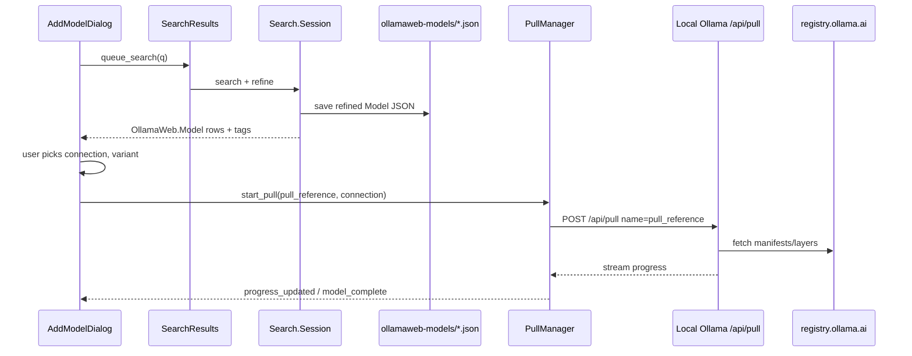

# 4.8.2 — Local pull from `libollamaweb` catalog data

**Status:** proposed

**Layout:** `docs/guide-to-writing-plans.md` — **Checklist for plans**

**Parent:** `docs/plans/4.8-ollama-web-live-search.md` (Phase 1 ✅, Phase 2.1 ✅)

**Related (done):** `docs/plans/done/1.3.4-DONE-pulling-models.md` — `PullManager`, `Call.Pull`, progress banner

**Coding standards:** `docs/coding-standards.md` — verify **Checklist for plans** before implementation

---

## Purpose

- **🔷** Keep **ollama.com live search** (`libollamaweb`) for discovery — search quality is good; **do not** replace it with a registry catalog API.
- **🔷** Use **catalog data we already fetch** (`OllamaWeb.Model` from search + tags-page refine) to start **local** model pulls.
- **🔷** Define the **pull reference** string passed to `POST /api/pull` on the user’s selected Ollama connection.
- **ℹ️** Prior investigation (registry API) confirmed: no public JSON catalog replaces tags-page refine; this plan assumes **refined per-slug JSON** under `{data_dir}/ollamaweb-models/` stays the detail source.

### Backlog (acceptance)

- **🔷** `⏳` **Pull reference** built from **`OllamaWeb.Model.slug`** + selected **`ModelVariant.name`**, not display `name`.
- **🔷** `⏳` **Start Download** blocked until the selected row has **refined tags** (size dropdown populated from refine).
- **🔷** `⏳` **Cloud-only variants** not offered for local pull (tags whose `name` contains `cloud` or `size == "-"`).
- **💩** `⏳` **Connection guard:** disable Start Download (or warn) when selected connection is not Ollama-native (`connection.ollama_native != 1`).
- **🔷** `⏳` Manual smoke: search → pick model → pick size → pull completes on local Ollama; model appears on Models page after `model_complete`.

---

## Current behaviour

- **ℹ️** `SearchResults` + `OllamaWeb.Search.Session` already provide shallow search rows and background **refine** (tags HTML → per-slug JSON in `data_dir/ollamaweb-models/`).
- **ℹ️** `AddModelDialog` wires search, size dropdown, and **Start Download** → `PullManager.start_pull(model_name, connection)` (`ollmapp/SettingsDialog/AddModelDialog.vala`).
- **ℹ️** Pull execution is unchanged from **1.3.4**: `Call.Pull` → `POST {connection.url}/pull` with `{"name": "<pull reference>", "stream": true}`; `PullManager` tracks progress in `data_dir/loading.json`.
- **🌗** Start Download uses **`selected_model.name`** + `":"` + **`tag.name`** — usually matches `slug`, but **`slug` is the canonical registry key** (especially for `author/model` derivatives).
- **🌗** No guard when **`tags` is empty** (refine not finished) — user can start pull with no variant or stale data.
- **🌗** Size dropdown sorts cloud tags last but **still lists them** — local `ollama pull` on a cloud tag will fail or pull the wrong artefact.

---

## Where models land (download location)

Two different “locations” — only one is under OLLMchat control:

### Pull target (OLLMchat controls)

- **🔷** User picks a **connection** in Add Model (default Ollama server URL, e.g. `http://127.0.0.1:11434/api`).
- **🔷** OLLMchat sends **`Call.Pull`** to that connection’s **`/api/pull`** endpoint.
- **ℹ️** `PullManager` / `PullManagerThread` already own this path — **no new download manager**.

### On-disk weights (Ollama controls)

- **ℹ️** The **local Ollama daemon** stores pulled blobs under its model directory (`OLLAMA_MODELS` or platform default, e.g. `~/.ollama/models/`).
- **🚫** OLLMchat does **not** choose or configure that directory in this plan (contrast **`8.0`** local GGUF under `~/.local/share/ollmchat/models/`).
- **ℹ️** During pull, Ollama resolves the reference against **`registry.ollama.ai`** (OCI manifests). OLLMchat never calls the registry directly.

### Pull reference → registry (mapping)

| Catalog field | Pull `name` | Registry path (resolved by Ollama, not OLLMchat) |
|---------------|-------------|--------------------------------------------------|
| `slug` = `llama3`, tag `8b` | `llama3:8b` | `registry.ollama.ai/v2/library/llama3/manifests/8b` |
| `slug` = `zerocopia/gemini-3-flash-preview`, tag `latest` | `zerocopia/gemini-3-flash-preview:latest` | `registry.ollama.ai/v2/zerocopia/gemini-3-flash-preview/manifests/latest` |

- **🔷** **Rule:** `pull_reference = slug` when no variant selected; else `slug + ":" + variant.name`.
- **ℹ️** `ModelVariant.name` from tags HTML is the **tag suffix** only (`8b`, `latest`, `4b-it-q4_K_M`) — matches what `ollama pull` expects after the model prefix.

---

## Proposed behaviour

### Data flow (search → pull)



### UI rules

- **🔷** **Search / refine:** unchanged — still `libollamaweb` HTML search + tags refine (`4.8` / `4.8.1`).
- **🔷** **Size dropdown:** only **local-pullable** variants (`ModelVariant` where tag name does not contain `cloud` and `size != "-"`).
- **🔷** **Start Download:**
  - disabled when `selected_model.slug == ""`
  - disabled when `selected_model.tags.size == 0` or `!selected_model.refined`
  - disabled when size dropdown has no local variants
  - **💩** disabled when `connection.ollama_native != 1` (after `detect_ollama` on dialog open)
- **🔷** On click: `pull_reference` from **`slug` + variant** → `PullManager.start_pull(pull_reference, connection)` (existing API).

### What we reuse (no duplicate fetch)

| Data | Source | Used for |
|------|--------|----------|
| Search hits | `Session.search` | Pulldown rows |
| Tag names, sizes, context | `Session.refine` → disk JSON | Size dropdown, pull suffix |
| `slug` | search row + disk | Pull reference prefix |
| `features` | search + tags page | List markup only (not pull) |
| Pull + progress | `PullManager` (**1.3.4**) | Download execution |

- **🚫** No second HTTP fetch at pull time (no registry client in OLLMchat).
- **🚫** No replacement of tags-page refine with `registry.ollama.ai` or `ollama.com/api/tags` (cloud-only).

---

## Complete change manifest

| Action | Path |
|--------|------|
| **Edit** | `ollmapp/SettingsDialog/AddModelDialog.vala` — pull reference, guards, filter cloud tags |
| **Edit** | `docs/plans/4.8-ollama-web-live-search.md` — link Phase 2.3 / pull-from-catalog |
| **🚫** | `libollamaweb/*` — no change (catalog shape already sufficient) |
| **🚫** | `PullManager` / `Call.Pull` — no change unless pull reference validation fails in testing |

---

## Concrete code proposals

Intro: hunks are **Remove** / **Replace with** / **Add**; verify context in tree before applying.

### 1. `ollmapp/SettingsDialog/AddModelDialog.vala` — Start Download: `slug`-based pull reference

**Why:** `slug` is the stable registry key; `name` is display-only and can diverge for derivatives.

**Where:** `start_download_button.clicked` handler (build `model_name` before `start_pull`).

**Depends on:** none.

#### Replace with — pull reference construction (inside clicked handler, after `selected_model.slug` check):

```vala
				var pull_reference = this.selected_model.slug;

				var size_index = this.size_dropdown.selected;
				if (size_index != Gtk.INVALID_LIST_POSITION &&
				    (int)size_index < this.size_list_store.get_n_items()) {
					var tag = this.size_list_store.get_item((uint)size_index) as OllamaWeb.ModelVariant;
					if (tag != null && tag.name != "") {
						pull_reference = pull_reference + ":" + tag.name;
					}
				}

				this.dialog.pull_manager.start_pull(pull_reference, connection);
```

#### Remove — old block that used `selected_model.name` and duplicate `start_pull` call:

```vala
				var model_name = this.selected_model.name;

				var size_index = this.size_dropdown.selected;
				if (size_index != Gtk.INVALID_LIST_POSITION &&
				    (int)size_index < this.size_list_store.get_n_items()) {
					var tag = this.size_list_store.get_item((uint)size_index) as OllamaWeb.ModelVariant;
					if (tag != null) {
						model_name = model_name + ":" + tag.name;
					}
				}
				
				// Start pull operation
				this.dialog.pull_manager.start_pull(model_name, connection);
				// this.dialog.pull_manager.start_pull(model_name, connection);
```

---

### 2. `ollmapp/SettingsDialog/AddModelDialog.vala` — guard pull until refine + filter cloud tags

**Why:** Pull must use refined tag list; cloud variants are not local-pullable.

**Where:** `update_size_dropdown()` — tag filter loop; `start_download_button.sensitive` updates.

**Depends on:** §1.

#### Replace with — `update_size_dropdown()` tag loop: skip cloud / remote-only rows

In the `foreach (var tag_obj in sorted_tags)` loop, **before** `this.size_list_store.append(tag_obj)`:

```vala
				if (tag_obj.name.down().contains("cloud") || tag_obj.size == "-") {
					continue;
				}
```

#### Add — at end of `update_size_dropdown()`, toggle Start Download

After `this.size_row.visible = true;`:

```vala
			this.start_download_button.sensitive =
				this.selected_model.refined
				&& this.size_list_store.get_n_items() > 0;
```

#### Add — in clicked handler, early return when not pullable

Immediately after `selected_model.slug == ""` check:

```vala
				if (!this.selected_model.refined || this.size_list_store.get_n_items() == 0) {
					return;
				}
```

---

### 3. `ollmapp/SettingsDialog/AddModelDialog.vala` — **💩** Ollama-native connection guard

**Why:** OpenAI-compatible endpoints do not implement `/api/pull`.

**Where:** `load()` after connections populated; `connection_dropdown` `notify::selected`.

**Depends on:** §2.

#### Add — helper sensitivity refresh (inline in `load()`, end of `item_selected` / connection change)

When connection selection changes, set:

```vala
			var conn_index = (int)this.connection_dropdown.selected;
			var can_pull = false;
			if (conn_index >= 0 && conn_index < this.connection_urls.size) {
				var url = this.connection_urls.get(conn_index);
				if (this.dialog.app.config.connections.has_key(url)) {
					can_pull = this.dialog.app.config.connections.get(url).ollama_native == 1;
				}
			}
			if (!can_pull) {
				this.start_download_button.sensitive = false;
			}
```

- **ℹ️** Call this after `update_size_dropdown()` and when connection dropdown changes.
- **💩** Optional tooltip on disabled button: “Pull requires an Ollama server connection”.

---

## Test plan

- **🔷** Search `llama` → select `llama3` → wait for sizes → pick `8b` → Start Download → verify `loading.json` entry name is `llama3:8b` (not display-only alias).
- **🔷** Search `gemini` → select a derivative `author/model` slug → pull reference uses **namespaced slug**.
- **🔷** Select model before refine completes → Start Download stays disabled → enables after tags arrive.
- **🔷** Model with only `*-cloud` tags → size row hidden or empty → Start Download disabled.
- **💩** Non-Ollama connection selected → Start Download disabled.
- **ℹ️** Regression: `meson test --suite ollamaweb`; existing `oc-test-pull` against local Ollama.

---

## LLM implementer guardrails

- **🚫** Do not add a `registry.ollama.ai` client or replace tags-page refine.
- **🚫** Do not change `PullManager` retry/progress semantics (**1.3.4**).
- **🚫** Do not add new `libollamaweb` types or pull-name helper methods unless user approves — inline in `AddModelDialog` per coding standards.
- **🚫** Do not conflate this with **`8.0`** local GGUF backend (`Connection.url` as directory path).

---

## Related / follow-on

- **ℹ️** `4.8` Phase 2.2 — category chips, per-row loading, 429 UX (orthogonal).
- **ℹ️** Add Model search fixed — [`docs/bugs/done/2026-06-02-FIXED-libollamaweb-add-model-search-spin-no-results.md`](../bugs/done/2026-06-02-FIXED-libollamaweb-add-model-search-spin-no-results.md)
- **💩** After pull completes, auto-register model on connection’s Models page config — out of scope (Models page already refreshes on `model_complete`).
