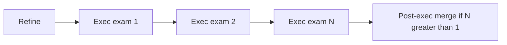
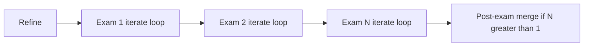
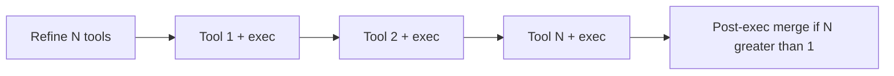
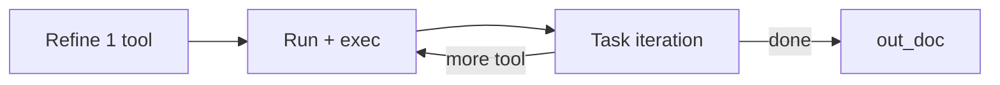
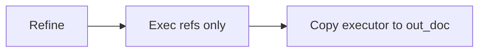
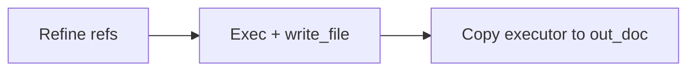
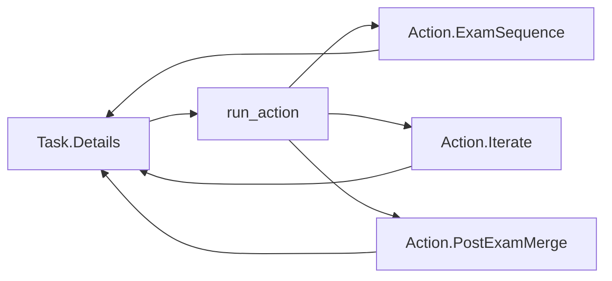

# 7.16 — Iterative task execution loop (overview)

**Status:** in progress (**7.16.1** done; **7.16.1b** partial)

**Pointer:** `docs/guide-to-writing-plans.md` — Checklist for plans · **Layout:** `docs/guide-to-writing-plans.md`

**ℹ️** Related: `docs/plans/done/7.14-DONE-task-progress-tree-ui.md`, `docs/plans/done/7.13-DONE-agent-save-restore.md`, `docs/task-and-skills-flow.md`, `docs/skills-format.md`

> **Note:** `docs/plans/1.0-summary.md` is not updated until sub-plans are done and archived.

---

## Sub-plans (implementation order)

| # | Plan | Summary |
| --- | --- | --- |
| **1a** | [`7.16.1-action-copy.md`](7.16.1-action-copy.md) | ✅ **Done** — Action **`run()`** copies + **extraction on `Base`** + build (`11d40d40`) |
| **1b** | [`7.16.1b-action-wire.md`](7.16.1b-action-wire.md) | **In progress** — extract wired; **`run_action`** + **`Details`** trim **remaining** |
| **2** | [`7.16.2-session-markers-replay.md`](7.16.2-session-markers-replay.md) | **`schema_version`** + session markers + replay for **`Action`** parity |
| **3** | [`7.16.3-action-iterate-wire.md`](7.16.3-action-iterate-wire.md) | **`Action.Iterate`** + wire in; drop **`RunTools`** |
| **4** | [`7.16.4-iterate-collateral.md`](7.16.4-iterate-collateral.md) | Prompts, skills, **`to_human`**, docs, replay cleanup |

Expand each sub-plan with concrete hunks before implementation.

---

## Progress (2026-06-10)

**Merged:** `11d40d40` — *refactor action classes of skill layer - prior to looping change*

**Approved design changes** (documented in [`7.16.1-action-copy.md`](7.16.1-action-copy.md)):

- **`Action.Base : OLLMchat.Agent.Base`** — shared chat/model context; constructor calls **`replace_chat(task.chat())`**.
- **Executor extraction** moved from **`ResultParser`** to **`Action.Base`** (**`extract_result`**, **`extract_tool`**) with **`WriteExec`** override and **`PostExamMerge.extract`**; live + replay call sites updated.
- **Partial wire only** — **`Tool.run`**, **`Details.run_post_exec`** (extract line), replay; **`Details.run_exec`** still inline until **7.16.1b**.

**Next:** **`Details.run_action`** dispatch and dedupe **`run_exec`** / **`run_post_exec`** on **`Details`**.

---

## Purpose

- **🔷** **Path B:** refinement schedules **one** tool call; **task iteration** adds more.
- **🔷** **Path A:** **no change** when the skill has **no** registered tools (typical exam-only flow). Iteration **only** if the skill lists tools (**ℹ️** rare).
- **🔷** Each iteration pass: **result summary** plus optional **one** more tool call; runner feeds **cumulative history** into the next pass.
- **🔷** Stop when **no** further tool call and a final summary → back to the task list.
- **🔷** **Inject tool-call history** so the model does not repeat the same calls (**writes:** path/outcome only, not full file content).
- **🔷** Drop **B-path** multi-tool refine + merge; **keep post-exam merge** when multiple examination refs (**A**).
- **🔷** Old skill sessions unreplayable; bump **session schema** (serialized), not a runner `#define`.
- **🔷** Flat **`liboccoder/Action/`** (**`OLLMcoder.Action.Iterate`**, etc.). **`Task.Details`** = storage + **internal** dispatch.
- **🔷** Fenced JSON in markdown for tools; classic **SKILL.md** style.
- **ℹ️** **Task list iteration** = `run_task_list_iteration` (revise whole list after a step). **Task iteration** = per-task loop here.

---

## Naming

- **🔷** Per-task stage: **task iteration** (not “review” / not “post-exec” in user-facing text).
- **ℹ️** **Task list iteration** unchanged (`task_list_iteration.md`, `ProgressRunner` row).
- **⏳** **`task_post_exec.md`** → **`task_iteration.md`** (**7.16.4**).
- **🔷** New sessions: **`agent-stage`** **`task_iteration`** (not **`post_exec`**) — see **Decisions**.

---

## Queue paths — today and after 7.16

**ℹ️** One **refine** per task; **`build_run_queue()`** picks **one** branch (`Details.vala`). Each subsection: **today** diagram, then **after 7.16**.

### A — Examination references

**ℹ️** One **`Tool` row per exam**; executor only (no registry tool on exam rows).

**Today**



**After 7.16 — skill has no tools** (**🔷** usual)

- **🔷** **No change** — same as **Today**; **`Action.ExamSequence`** + **`PostExamMerge`** (**7.16.1**).

**After 7.16 — skill has tools** (**🔷** rare)



### B — Proposed tools (main redesign)

**Today**



**After 7.16** (**7.16.3**)



- **7.16.1a:** **`RunTools`** copied (not wired). **7.16.1b:** live dispatch. **7.16.3:** swap **`Iterate`** for **`RunTools`**.

### C — Shared references only

**Today / after:** **no change** — **`Action.RefOnly`** (**7.16.1**).



### D — Write skills

**Today / after:** **no change** on happy path — **`Action.WriteExec`** (**7.16.1**).



---

## Architecture — `OLLMcoder.Action` vs `OLLMcoder.Task`

- **ℹ️** **`Task.Details`** today: data + path-dependent behaviour — to slim over sub-plans.
- **🔷** **`OLLMcoder.Action`**: flat `liboccoder/Action/` — **`Base`**, **`Iterate`**, **`ExamSequence`**, …
- **🔷** All runners **extend `Action.Base`** (**`Agent.Base`** subclass — see **Progress**); **`Details.run_action`** picks runner (**no `Factory.vala`**). **⏳** **`run_action`** not implemented yet.
- **🚫** No **`Action.Task.*`** nesting; not a subclass of **`Details`**.

```text
liboccoder/Action/
  Base.vala
  RunTools.vala        # 7.16.1 only — removed 7.16.3
  Iterate.vala         # 7.16.3
  ExamSequence.vala
  PostExamMerge.vala
  RefOnly.vala
  WriteExec.vala
```



**Dispatch:** wire sketch in [`7.16.1b-action-wire.md`](7.16.1b-action-wire.md); path **B** line changes in [`7.16.3-action-iterate-wire.md`](7.16.3-action-iterate-wire.md).

---

## Progress tree (7.14)

- **ℹ️** **`Details`** → nested **`Tool`** rows; **`status_str`** = **`PhaseEnum.to_human()`**.
- **🔷** Keep that model; append **`Tool`** per registry run; dynamic **`Details`** stage during iteration.
- **💩** Full **`to_human` draft:** below — implement in **7.16.4** (labels may start appearing in **7.16.3**).

---

## Progress status — `to_human` draft (**💩** placeholders)

**💩** Provisional — tune when **7.16.3** / **7.16.4** run in UI. Details in sub-plans; full catalog kept here for one-page review.

### Already today

- **ℹ️** **`Tool`:** **Running Tool(s)**, **Review output**, **Retry Review output**, **Writing Files**, **✓**, **Retry Failed**.
- **ℹ️** **`Details`:** **Refine**, **Refinement Retrying**, **Post review** (`POST_EXEC`).

### Iteration (7.16.3 / 7.16.4)

- **💩** **`Details`:** **Iterating**, **Iterating (n)**, **Task iteration** / **Summarizing**, **Iteration retry**, **Iteration limit**.
- **ℹ️** **`Tool`:** same per-cycle sequence as today.
- **💩** Wire **`task_iteration`** → **`TASK_ITERATION`**.

### Storyboard (path **B**, two cycles)

```text
Details  "Find logger usages"     Refine
Tool     codebase_search          Running Tool(s)
Tool     codebase_search          Review output
Details  "Find logger usages"     Iterating (1)
Details  "Find logger usages"     Task iteration
Tool     codebase_search          Running Tool(s)
Tool     codebase_search          Review output
Details  "Find logger usages"     Iterating (2)
Details  "Find logger usages"     Task iteration
Details  "Find logger usages"     ✓
```

---

## Decisions

### Max cycles

- **🔷** **20** per **`Action.Iterate`** loop (and per exam sub-loop if **A + tools** ever ships).

### Progress UI

- **🔷** Reuse **`Details` → `Tool`** tree; no new row class in **7.16.1**.

### `post_exec` wire id

- **ℹ️** **`agent-stage`** body in session transcript — replay uses it to know which parser to run (not GTK “wiring”).
- **🔷** New sessions: **`task_iteration`**; drop **`post_exec`** handling in new replay (**7.16.4**).

---

## Open questions

- **💩** **A + tools** — only if that gate is built.
- **💩** **Summarizing** vs **Task iteration** vs **Iterate** on stage column — pick after dogfood.

---

## LLM notes (overview)

- **🚫** No **`REPLAY_PROTOCOL`** const — use session **`schema_version`**.
- **🚫** No parallel tools in one cycle.
- **🚫** Flat **`liboccoder/Action/`** only.
- **🚫** Dispatch on **`Details`**, not a factory type.
- Implement from **sub-plans** in order; expand **Concrete code proposals** there, not in this file.
