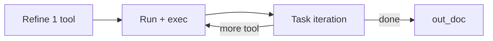

# 7.16.3 — `Action.Iterate` and wire in

**Status:** proposed

**Parent:** [`7.16-iterative-task-execution-loop.md`](7.16-iterative-task-execution-loop.md)

**Depends on:** [`7.16.2-session-markers-replay.md`](7.16.2-session-markers-replay.md)

**Blocks:** [`7.16.4-iterate-collateral.md`](7.16.4-iterate-collateral.md)

**Pointer:** `docs/coding-standards.md` — Checklist for all plans · **Layout:** `docs/guide-to-writing-plans.md`

> **Note:** `docs/plans/1.0-summary.md` is not updated until this sub-plan is done and archived.

---

## Purpose

- **🔷** Add **`Action.Iterate`** — path **B** redesign: refine **one** tool, then **task iteration** loop.
- **🔷** Wire dispatch: **`RunTools`** → **`Iterate`**; remove **`RunTools`**.
- **🔷** **Tool-call history** in each iteration prompt; **20** cycle cap.
- **🔷** Live **`agent-stage`** **`task_iteration`**; replay for iteration cycles (extends **7.16.2** markers).

---

## Target flow (path **B**)



- **🔷** Refine: at most **one** fenced JSON tool.
- **🔷** Each cycle: **`Tool.run`** (if queued tool) → task-iteration LLM.
- **🔷** Iteration output: **`## Result summary`**; optional **one** **`## Tool Calls`** JSON.
- **🔷** Stop when no tool call + final summary → **`out_doc`**.
- **🔷** **No** multi-tool merge of N refinement runs.

---

## Task iteration loop

- **🔷** One cycle = run pending tool + executor → **`run_task_iteration`** (rename from **`run_post_exec`** internally **💩** `⏳`).
- **🔷** Parse iteration response; enqueue next **`Tool`** or finish.
- **🔷** **Max 20 cycles** — then error + stop (**🔷** parent **Decisions**).

---

## Tool-call history (prompt contract)

- **🔷** Build **`tool_call_history`** (or **`{execution_log}`**) from completed cycles in order.
- **🔷** Each entry: cycle index, tool name, args, truncated result, iteration summary line.
- **🔷** Instruction: do not repeat prior calls unless intentionally refining a failure.
- **🔷** **Writes:** path / mode / outcome only — **not** full file **content**.
- **💩** `⏳` Dedupe hint in **`task_iteration.md`** template.
- **ℹ️** **`tool_runs_combined`** one-shot merge goes away for path **B**.

---

## Dispatch change

```vala
// Details.run_action — path B line only:
if (this.proposed_tools.size > 0 || needs_iterate_loop (this))
    yield new Action.Iterate (this).run ();
```

- **🔷** Remove **`RunTools.vala`** from build (or dead-code delete).
- **💩** `⏳` **`needs_iterate_loop`** — only path **B** with tools, or broader **💩** TBC.

---

## Session / replay (this sub-plan)

- **🔷** Emit **`agent-stage`** **`task_iteration`** per iteration LLM wait.
- **🔷** Extend phase 2 meta with **`cycle`**, **`done` vs more-tool** flags.
- **🔷** **`Runner.on_replay`**: hydrate iteration cycles on schema **2+**.
- **ℹ️** **`post_exec`** wire id obsolete for new sessions — full removal of replay branch in **7.16.4**.

---

## Path **A** + skill tools (**💩** rare)

- **🔷** Unchanged in usual case (no skill tools) — still **`ExamSequence`** (**7.16.1**).
- **💩** If **A + tools** ships: per-exam **`Iterate`** sub-loop + post-exam merge — separate follow-up unless bundled here.

---

## Progress UI (this sub-plan)

- **💩** New **`PhaseEnum`** + **`to_human`** — see parent **Progress status — `to_human` draft** (phase 3 section).
- **🔷** **`Details`**: **Iterating**, **Iterating (n)**, **Task iteration** / **Summarizing**, retries, cap.
- **🔷** **`Tool`**: existing **Running Tool(s)** → **Review output** → **✓** per cycle.
- **💩** Storyboard in parent — tune order when dogfooding.

---

## Acceptance

- **🔷** Two-cycle search task: second query differs; history visible; final **`out_doc`**.
- **🔷** Path **A / C / D** still pass **7.16.1** acceptance.
- **🔷** Save → reload on schema **2**: iteration cycles replay correctly.
- **🔷** 21st cycle attempt fails with clear UI error.

---

## Concrete code proposals

**⏳** Expand when sub-plan approved.

#### `Action/Iterate.vala`

```vala
namespace OLLMcoder.Action {
    public class Iterate : Base {
        public Iterate (Task.Details task) : base (task) {}
        public override async void run () throws Error {
            var history = "";
            var cycle = 0;
            while (cycle < 20) {
                yield task.run_pending_tool_or_lone_exec ();
                var it = yield run_task_iteration_pass (task, cycle, history);
                if (!it.has_tool_call) break;
                append_history (ref history, it);
                task.enqueue_tool (it.tool);
                cycle++;
            }
            // set exec_done, out_doc from final iteration parse
        }
    }
}
```

#### `Details.run_action` — path B

```vala
yield new Action.Iterate (this).run ();
```

---

## LLM notes

- **🚫** Refine cap (reject 2 fences) lives in **7.16.4** unless needed earlier for safety.
- **🚫** Full **`task_iteration.md`** prose in **7.16.4** — stub/template OK here.
