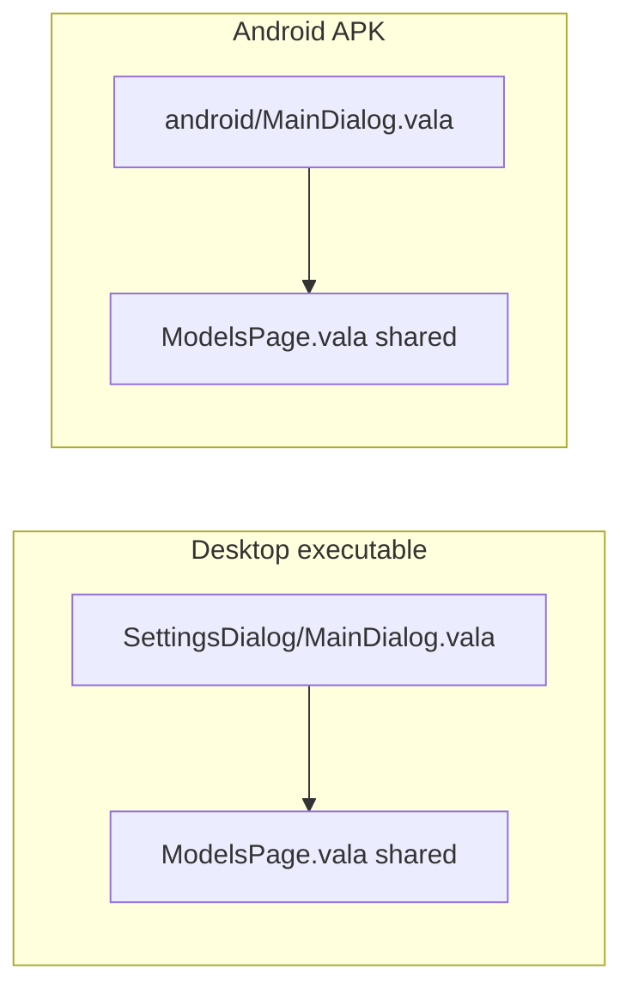

# 9.3 Android settings — lightweight `MainDialog` + reuse `ModelsPage`

> **Do not update `docs/plans/1.0-summary.md` for this plan.**

**Status:** ACTIVE — ready to implement after user approval

**Parent:** [`9.0-android-poc-summary.md`](9.0-android-poc-summary.md) — Models settings tab (item 2 in **Suggested order**)

**Pointer:** `docs/guide-to-writing-plans.md` — checklist; Vala follows `docs/coding-standards.md`.

**Golden rule:** Android shell in `ollmapp/android/` + Android meson. **One small shared edit** in `ModelsPage.vala` (see Phase 2) — needs explicit approval.

---

## Purpose

- **🔷** Replace the Android **manual** models tab (connection dropdown + model name field) with the **same** `ModelsPage` / `ModelRow` UI as desktop.
- **🔷** Do that by giving Android its **own lightweight `SettingsDialog.MainDialog`** — **not** by subclassing or calling the desktop `MainDialog`.
- **🔷** Delete `AndroidSettingsDialog` once the Android `MainDialog` is wired.

---

## Plain explanation

### What we have today

| Build | Settings container class | Models UI |
|-------|-------------------------|-----------|
| Desktop | `SettingsDialog.MainDialog` | `ModelsPage` — full model list, expand options |
| Android | `AndroidSettingsDialog` | Manual “default model” rows only |

Shared widgets (`ModelsPage`, `ModelRow`, `ConnectionsPage`) are written like this:

```vala
public ModelsPage(MainDialog dialog) { ... }
```

They expect a parent object **typed** `MainDialog`. Android passes `AndroidSettingsDialog` — **wrong type**, even though the shell layout is similar.

### What we want

Android should use **`ModelsPage` unchanged**. For that, Android needs something the compiler accepts as `MainDialog`.

### The trick (not a hack)

Desktop and Android **never link the same executable**. Meson already uses **different source lists** per target.

So:

- **Desktop build** links `ollmapp/SettingsDialog/MainDialog.vala` — full dialog (Connections, Models, Projects, Tools).
- **Android build** links `ollmapp/android/MainDialog.vala` — **different file**, **same class name** `OLLMapp.SettingsDialog.MainDialog`.

Same name, two implementations, only one per APK/binary. No casting. No subclass of the desktop class.



### Do **not** extend desktop `MainDialog`

Desktop `MainDialog` is ~300 lines and **always** creates:

- `ProjectsPage`, `ToolsPage`
- `OllmchatWindow parent` (desktop window type)
- WIDE tab switcher, 800×800

Subclassing it on Android would drag that in or fight the constructor. **Wrong approach.**

Android `MainDialog` is a **separate class with the same name**, copied/slimmed from today’s `AndroidSettingsDialog` + the **shell bits** from desktop `MainDialog` (ViewStack, action bar, `PullManager`, page switching). **Connections + Models tabs only.**

---

## Android `MainDialog` — what it contains

Evolve `AndroidSettingsDialog.vala` → `android/MainDialog.vala` in namespace `OLLMapp.SettingsDialog`.

| Piece | Source / notes |
|-------|----------------|
| ViewStack + NARROW ViewSwitcher | Already in `AndroidSettingsDialog` |
| `ConnectionsPage` | Reuse shared page (replace inlined connection list) |
| `ModelsPage` | Reuse shared page (replace manual model entry) |
| `action_bar_area` | Copy pattern from desktop — search / Add Model / Refresh sit here |
| `PullManager` + `PullManagerBanner` | Required by `ModelsPage` / Add Model |
| `app`, `parent`, `pull_manager` | Public fields pages already read |
| `show_dialog`, `on_closed`, `check_all_connections` | Same flow as today’s Android settings + desktop models refresh |
| Size | Keep mobile 400×576 (or tune on device) |

**Not included:** Projects, Tools, desktop-only startup (`tools_page.load_tools`, etc.).

**Constructor:** `MainDialog(AndroidMainWindow parent)` with `Object(app: parent.app)` — mirrors desktop `MainDialog(OllmchatWindow parent)` but Android parent type.

---

## One shared fix (approved separately)

`ModelsPage` finds the model list store like this:

```vala
var parent_window = this.dialog.parent as OllmchatWindow;
```

On Android, `parent` is `AndroidMainWindow` — cast fails, code creates a **second** `ConnectionModels` that is **not** the chat bar’s store.

**Fix:** In `ModelsPage` constructor, also check `AndroidMainWindow` → `history_manager.connection_models`. **~5 lines, one file.** Without this, the Models tab and chat bar show different lists.

---

## Phases

### Phase 0 — Meson (Android only)

Add to `android_poc_sources` in `ollmapp/meson.build` (both Android and host-android-poc blocks):

- `SettingsDialog/SettingsPage.vala`
- `SettingsDialog/ConnectionsPage.vala`
- `SettingsDialog/ModelsPage.vala`
- `SettingsDialog/ModelRow.vala`
- `SettingsDialog/AddModelDialog.vala`
- `SettingsDialog/SearchablePulldown.vala`
- `SettingsDialog/PullStatus.vala`
- `SettingsDialog/PullManager.vala`
- `SettingsDialog/PullManagerThread.vala`
- `SettingsDialog/PullManagerBanner.vala`
- `SettingsDialog/Rows/*.vala` (all row types used by `ModelRow`)
- `android/MainDialog.vala` (new)

**Do not** add desktop `SettingsDialog/MainDialog.vala` to Android sources.

Remove `android/AndroidSettingsDialog.vala` when Phase 1 lands.

### Phase 1 — Android `MainDialog` (Android only)

- **Add** `ollmapp/android/MainDialog.vala` — lightweight shell as above.
- **Delete** `AndroidSettingsDialog.vala`.
- **Update** `AndroidMainWindow`, `AndroidStartup`, `AndroidBootstrapConnectionAdd` — `SettingsDialog.MainDialog` instead of `AndroidSettingsDialog`.

### Phase 2 — `ModelsPage` connection store (shared — needs approval)

- **Edit** `ModelsPage.vala` — resolve `connection_models` from `AndroidMainWindow.history_manager` when desktop cast fails.

### Phase 3 — Device verify

- Open Settings → Models tab: list matches chat bar models.
- Expand a model row, change an option, close settings, confirm persist.
- Add Model / Refresh (if server reachable on device).

---

## What stays untouched

- **🚫** Desktop `ollmapp/SettingsDialog/MainDialog.vala` — no edits for this plan.
- **🚫** `ModelsPage` / `ModelRow` behaviour beyond Phase 2 store lookup.
- **🚫** Projects, Tools, MCP on Android.

---

## Suggested order (within 9.0)

1. User approves Phase 2 shared touch.
2. Phase 0 meson + Phase 1 Android `MainDialog`.
3. Phase 2 `ModelsPage` fix.
4. Build APK + Phase 3 device verify.

---

## Code map

| Role | File |
|------|------|
| Android shell (new) | `ollmapp/android/MainDialog.vala` |
| Android shell (remove) | `ollmapp/android/AndroidSettingsDialog.vala` |
| Desktop shell (unchanged) | `ollmapp/SettingsDialog/MainDialog.vala` |
| Shared models tab | `ollmapp/SettingsDialog/ModelsPage.vala`, `ModelRow.vala` |
| Shared connections tab | `ollmapp/SettingsDialog/ConnectionsPage.vala` |
| Callers | `AndroidMainWindow.vala`, `AndroidStartup.vala` |
| Build | `ollmapp/meson.build` `android_poc_sources` |

---

## Concrete code proposals

**⏳ Deferred** — add Remove/Replace hunks when user approves implementation (Phase 0–2).
