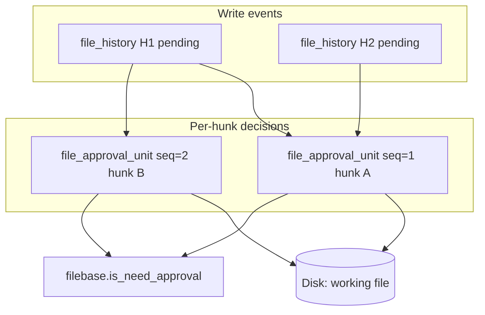

# 4.2.3. URGENT - SourceView inline diff (approve / reject)

> **Do not update `docs/plans/CODER-1.0-summary.md` for this plan.**

**Status:** **URGENT** · **DESIGN OPEN** · **⏳** implementation **blocked** until baseline, partial-approval, and undo/approval separation are designed

**Pointer:** `docs/guide-to-writing-plans.md` — **Checklist for plans**; proposed Vala follows **`docs/coding-standards.md`**

**Parent:** [`done/4.2-DONE-code-editor-tool.md`](done/4.2-DONE-code-editor-tool.md) — Phase 6 (split from ⏳ FUTURE)

**Related:**

- ℹ️ Shipped list + approve/reject: [`done/2.10.4.26-DONE-file-history-approval-knock-on.md`](done/2.10.4.26-DONE-file-history-approval-knock-on.md)
- ℹ️ Daemon approve/revert: [`done/2.10.4.25-DONE-file-history-approval.md`](done/2.10.4.25-DONE-file-history-approval.md)
- ℹ️ Diff library: [`done/5.2-DONE-diff-match-patch-simple-port.md`](done/5.2-DONE-diff-match-patch-simple-port.md) — `OLLMfiles.Diff.Differ`
- ℹ️ Hunk merge reference: [`examples/oc-diff.vala`](../../examples/oc-diff.vala)

---

## Purpose

### Confirmed (UI — ship when design unblocks)

- 🔷 Pending-approval files show an **inline unified diff** in `SourceView` (not a second editor pane).
- 🔷 **Secondary gutter** — baseline line numbers beside the normal gutter.
- 🔷 **Added** lines: green background.
- 🔷 **Removed** lines: red background; interleaved rows (unified-diff style).
- ✔️ Per-file **Approve** / **Reject** / changed-files list on **`Approvals`** bar — shipped today; **placement of destructive / bulk actions** is still ⏳ (see below).
- 🔷 Destructive review actions (whole-file reject, **approve all files**, reject all) must **not** sit as casual primary UI — tuck away (e.g. changes-list menu), with explicit revert.

### Open (must decide before coding)

- 🔷 ⏳ **Partial approval** — user may accept **some** hunks/lines/chunks, not only whole-file approve.
- 🔷 ⏳ **What the diff is against** — which stored snapshot is “baseline” while review is in progress.
- 🔷 ⏳ **Intermediate approved state** — where a partly-approved file lives between clicks and between LLM rounds.
- 🔷 ⏳ **Stacked LLM edits** — file still pending (or partly approved); agent writes again; what diff do we show?
- 🔷 ⏳ **Undo approval vs undo edit** — approval rollback must **not** rely on editor undo/redo (see **Cursor contrast** below).
- 🔷 ⏳ **Bulk approve all files** — if offered at all, placement, confirmation, and **revert bulk approve** (see **Destructive actions**).

**Suggested order**

1. 🔷 ⏳ Walk through **Design — user walkthrough** + **SQLite model** below — confirm or correct before coding.
2. 🔷 ⏳ Close remaining ⏳ bullets in **Design — approval baseline** (anything the walkthrough does not settle).
3. 🔷 ⏳ Design **diff UI** and **destructive-action placement** (changes dropdown, bulk actions, revert paths).
4. 🔷 ⏳ Add **implementation spec** (code fences) to this plan or a sub-plan — only after 1–3.

---

## Design — user walkthrough (flows)

ℹ️ **Goal:** one readable path from “agent wrote the file” → “user clicks approve on hunks” → “what SQLite holds” → “agent writes again” → “carry-forward / re-review”. Names below are **proposal** until you sign off.

### Vocabulary

- **Write chunk** — one agent/tool edit → one **`file_history`** row (`backup_path` = snapshot **before** that write; disk = **after**).
- **Hunk** — one contiguous block in the inline diff (added/removed lines the user sees as a unit).
- **Approval unit** — one user action: “I accept **this hunk** of **this write chunk**” → one row in proposed **`file_approval_unit`** table.
- **Working file** — on-disk content after hunks the user has already approved in this review (may differ from full agent proposal until all hunks approved).
- **Approved head** — last fully signed-off content for the file (all pending hunks for all chunks resolved, or whole-file approve today).

### Flow A — Agent writes; user partial-approves (happy path)

**Setup:** `foo.vala` on disk is version **V0**. Agent writes **V1** (changes around lines 2 and 5 — **hunk A**, **hunk B**).

| Step | User sees | Daemon / disk | SQLite |
|------|-----------|---------------|--------|
| 1 | File appears in changed-files list; editor opens in **diff mode** | Disk = **V1**; backup file = **V0** | `file_history` **H1**: `status=0` (pending), `backup_path`→V0 |
| 2 | Unified diff: hunk **A** (line ~2) green/red; hunk **B** (~5) still pending | Unchanged **V1** | — |
| 3 | User clicks **Approve** on hunk **A** | Apply **A** only: working file becomes **V0+A** (hunk **B** not applied yet) | `file_approval_unit` **U1**: `file_history_id=H1`, `hunk_index=0`, `seq=1`, `status=1`; store **approved text** / patch coords for **A** |
| 4 | Diff refreshes: **A** dimmed or “approved”; **B** still red/green vs new baseline | Disk = **V0+A**; diff baseline = working file, not raw **V1** | `file_history` **H1**: `status=2` (**partial**) ⏳ new enum value |
| 5 | User approves hunk **B** | Disk = **V1** (full agent proposal accepted) | **U2**: `hunk_index=1`, `seq=2`, `status=1`; **H1**: `status=1`; `filebase.is_need_approval=0` |

ℹ️ **Approve order matters:** **`seq`** records click order (1 then 2). Unapprove / audit / bulk revert can walk **`seq`** backwards.

ℹ️ **Whole-file Approve today** = one step: all hunks + **H1** → approved (equivalent to approving every hunk in one batch with shared **`batch_id`**).

### Flow B — Agent writes again while review incomplete (stacked edit)

**Setup:** After step 4 above (only **A** approved), agent writes **V2** before user approves **B**.

| Step | User sees | Daemon / disk | SQLite |
|------|-----------|---------------|--------|
| 1 | Notification: file changed again | New backup = **V0+A** (working file before second write); disk = **V2** | **`file_history` H2**: pending, `backup_path`→working copy |
| 2 | Diff for **H2** vs **V0+A** | — | **H1** stays **partial**; **U1** still `status=1` |
| 3 | System **carry-forward scan** (see Flow D) | Marks which old approvals still apply to **V2** | New rows or flags on **U1** → `superseded_by_history_id=H2`, `carry_state` ⏳ |

🔷 ⏳ **Open:** does partial progress on **H1** **block** the agent, **merge** into **H2**, or **fork** a new review session? Walkthrough assumes **H2** is the active diff; **H1** hunks not yet approved may be **obsolete** or **re-targeted**.

### Flow C — Carry-forward / re-approve after newer write

When **H2** exists, daemon (or client with daemon verify) for each **`file_approval_unit`** with `status=1` on this file:

1. Load **approved payload** for the unit (text added/changed, or patch relative to that chunk’s `backup_path`).
2. Locate same semantic change in **H2**’s diff (match by **content hash**, **context lines**, or **`PatchApplier`** fuzzy apply).
3. Set **`carry_state`** on the unit:
   - **`carried`** — still valid in **V2**; UI shows pre-checked / dimmed approved.
   - **`needs_review`** — overlapping region changed; user must approve again on **H2**’s hunk list.
   - **`lost`** — hunk gone (agent removed that edit); unit stays in history but not applied.

🔷 ⏳ No silent auto-approve on carry-forward unless user prefers “trust carried hunks” setting.

### Flow D — Unapprove one hunk (not editor undo)

| Step | User sees | Storage |
|------|-----------|---------|
| 1 | User **Unapprove** on hunk **A** (was **U1**) | **U1**: `status=-1` (unapproved) or new **`file_approval_unit`** row type **`unapprove`** with `seq=3` ⏳ |
| 2 | Working file rebuilt from **V0** + remaining approved units (**none** if only **A** was approved) | Re-apply patch list in **`seq`** order, skip unapproved |
| 3 | Diff shows **A** pending again | **H1** back to **partial** or **pending** |

ℹ️ **Not** `Ctrl+Z`. **`file_approval_unit.seq`** + **`file_history`** is the audit trail.

### Flow E — Reject whole file

User picks **Reject** (destructive; menu/bar TBD):

- Restore disk from **`reject_id`** backup (today: newest `file_history` row with `backup_path`).
- Mark pending **`file_history`** rows rejected; **`file_approval_unit`** rows for those chunks → `status=-1` or archived ⏳.
- **`filebase.is_need_approval=0`**.

🔷 ⏳ After partial approve, reject target: **pre-first-write V0**, **last working file**, or confirm dialog?

### Flow F — Bulk approve all files

User opens **changes-list menu** → **Approve all pending** → confirm “**N** files, **M** hunks”:

- One **`file_approval_batch`** row (`id`, `timestamp`).
- Each hunk approve gets same **`batch_id`**; **`seq`** still per-file.
- **Revert last bulk approve** = invert batch (new **`unapprove`** units or flip status) using **`batch_id`** — not undo stack.

---

## Design — SQLite model (proposal)

ℹ️ Shipped schema: [`ollmfilesd/FileHistory.vala`](../../ollmfilesd/FileHistory.vala) **`init_db`**. Partial approval needs **finer rows** than whole **`file_history.status`**.

### Shipped today (unchanged role)

**`file_history`** — one row per write chunk

- **`id`**, **`filebase_id`**, **`path`**, **`timestamp`**, **`change_type`**, **`backup_path`**
- **`status`**: `0` pending · `1` approved · `-1` rejected (⏳ add **`2` partial** when any hunk approved but chunk not closed?)
- **`since_id`** — pending-list delta poke ([`2026-08-12` bug doc](../../docs/bugs/done/2026-08-12-FIXED-changed-files-notification-approvals-ui.md))

**`filebase`**

- **`is_need_approval`** — file still in review set
- **`last_change_type`** — display hint

Whole-file approve today: flip **`status`** on pending **`file_history`** rows in place — **no** per-hunk rows.

### Proposed: `file_approval_unit` (new table)

One row per **hunk approve**, **hunk unapprove**, or **carried-forward** decision.

| Column | Type | Role |
|--------|------|------|
| **`id`** | INTEGER PK | |
| **`filebase_id`** | INT64 | File |
| **`file_history_id`** | INT64 | Write chunk this hunk belongs to (**H1**, **H2**, …) |
| **`hunk_index`** | INT | 0-based index in unified diff for that chunk |
| **`seq`** | INT64 | **Global per-file approve order** (monotonic; unapprove gets next seq) |
| **`status`** | INT | `1` approved · `-1` unapproved/rejected · `0` pending re-review |
| **`approved_at`** | INT64 | Timestamp |
| **`batch_id`** | INT64 | `0` or FK → **`file_approval_batch`** for bulk approve all |
| **`baseline_start_line`** | INT | Line range in chunk’s **`backup_path`** snapshot ⏳ |
| **`baseline_end_line`** | INT | |
| **`proposed_start_line`** | INT | Line range in agent proposal (pre-apply) ⏳ |
| **`proposed_end_line`** | INT | |
| **`approved_text_hash`** | TEXT | Fingerprint of accepted new text (carry-forward matching) |
| **`approved_text`** | TEXT | Optional small payload; large hunks → blob file path ⏳ |
| **`superseded_by_history_id`** | INT64 | Set when newer **`file_history`** row replaces this review context |
| **`carry_state`** | TEXT | `''` · `carried` · `needs_review` · `lost` ⏳ |

🔷 ⏳ **Alternative:** store only **`patch_json`** (hunk coords + lines) instead of line ranges — aligns with [`OLLMfiles.Diff`](../../libocfiles/Diff/) / [`examples/oc-diff.vala`](../../examples/oc-diff.vala).

### Proposed: `file_approval_batch` (new table, optional)

| Column | Role |
|--------|------|
| **`id`** | PK |
| **`timestamp`** | When bulk action ran |
| **`action`** | `approve_all` · `reject_all` · `revert_batch` |
| **`file_count`**, **`unit_count`** | Confirm dialog echo / audit |

### Proposed: `filebase` column (optional)

| Column | Role |
|--------|------|
| **`approved_working_path`** | Path to on-disk **working file** during partial review (successor to old **`last_approved_copy_path`**) ⏳ |

Or: derive working file by re-applying **`file_approval_unit`** patches to latest backup — no extra column, more CPU on open.

### How tables interact (mermaid)

### Queries the UI will need (names only)

- Pending hunks for open file: **`file_history`** head + **`file_approval_unit`** where `status=1` grouped by **`hunk_index`**
- Approve order timeline: **`file_approval_unit`** for **`filebase_id`** `ORDER BY seq`
- Carry-forward on new write: approved units for file where **`file_history_id`** ≤ previous head and **`carry_state`** not **`lost`**
- Revert bulk: all units with **`batch_id`** = X, invert in reverse **`seq`** order

### Walkthrough → open questions (short map)

| Earlier ⏳ question | Walkthrough answer (proposal — confirm?) |
|-------------------|------------------------------------------|
| Partial granularity | **Hunk** within **`file_history`** chunk → **`file_approval_unit`** |
| Intermediate storage | **Working file** on disk + unit rows; optional **`approved_working_path`** |
| Baseline for diff | **Working file** after each partial approve (Flow A step 4) |
| Stacked LLM edit | New **`file_history`** row; **carry-forward scan** (Flow C) |
| Approval order | **`file_approval_unit.seq`** per file |
| Undo approve | New unit or flip status; rebuild working file — **not** GtkSource undo |
| Bulk approve | **`file_approval_batch`** + shared **`batch_id`** |

---

## Design — approval baseline and partial approval

ℹ️ Parent context: [`done/4.2-DONE-code-editor-tool.md`](done/4.2-DONE-code-editor-tool.md) Phase 6 (“temporary approved copy”, diff against that, sliding window when further changes occur).

ℹ️ Shipped today ([`done/2.10.4.25-DONE-file-history-approval.md`](done/2.10.4.25-DONE-file-history-approval.md)):

- One **file** row in `ReviewFiles` with **`approve_id`** (newest pending `file_history` row) and **`reject_id`** (newest row with backup).
- **Approve (whole file):** marks that row and all older pending rows on the file approved.
- **Reject (whole file):** restores from **`reject_id`** backup; disk + DB update; client `File.read`.
- Multiple **`file_history`** rows per file already exist (timeline); UI collapses to one popover row per file.

### Cursor contrast (what to avoid)

ℹ️ In Cursor, rolling back an approval decision is **hard** — it is effectively bundled into **undo/redo**, not a first-class “I changed my mind about this approve” action. That is **counterintuitive** for a review workflow.

ℹ️ Cursor also exposes **approve all changes** across **multiple files** alongside per-file approve — both classes of action are **highly destructive** but easy to hit from the general review UI.

- 🔷 Approval state changes must be **explicit review actions**, not aliases of **`Ctrl+Z` / `Ctrl+Shift+Z`** on the text buffer.
- 🔷 ⏳ **Unapprove / rollback approval** — dedicated affordance(s) with clear semantics:
  - whole-file “undo approve” while file still in review?
  - per-hunk “unaccept” after partial approve?
  - distinct from **Reject** (which restores disk from backup)?
  - **bulk** “undo approve all” if bulk approve exists?
- 🔷 ⏳ **`file_history` timeline** should be the audit trail for approve/unapprove — not the GtkSource undo stack.
- 🔷 ⏳ After user **edits the file manually** during review, undo stack and approval state must stay **separate** (manual edit undo ≠ unapprove LLM hunk).

### Destructive actions (placement + revert)

🔷 Whole-file **Approve** and **Reject** (and any **approve all / reject all**) mutate disk + `file_history` — treat as **destructive**, not generic toolbar actions.

- 🔷 ⏳ **Primary bar** — keep for **navigation** (next file, open changed file) and **non-destructive** review chrome; reconsider whether per-file Approve/Reject stay as prominent **`suggested-action`** buttons long term.
- 🔷 ⏳ **Bulk actions** — if we ship **approve all pending files** (Cursor parity), place in **changes-list overflow** (popover / dropdown menu on the changed-files control), **not** next to everyday editor chrome.
- 🔷 ⏳ **Confirmation** — bulk approve all and bulk reject all likely need an explicit confirm step (count of files + chunks).
- 🔷 ⏳ **Revert bulk actions** — must exist as first-class operations:
  - revert last bulk approve (restore pending state per file)?
  - or per-file unapprove only (no single “undo all”)?
  - backed by `file_history` / batch id — **not** editor undo.
- ℹ️ Shipped today: per-file Approve/Reject on [`liboccoder/Approvals.vala`](../../liboccoder/Approvals.vala) header — redesign may move or restyle when diff UI lands.

### Questions to close (user + design review)

ℹ️ Start from **Design — user walkthrough** + **SQLite model** above; items below are what the walkthrough still leaves open.

- 🔷 ⏳ **Sign off walkthrough** — Flow A–F and table columns: correct mental model?
- 🔷 ⏳ **`file_history.status=2` (partial)** — needed, or infer partial only from **`file_approval_unit`** counts?
- 🔷 ⏳ **Working file rebuild** — on each partial approve (eager) vs on read (lazy re-apply patches)?
- 🔷 ⏳ **Carry-forward** — auto-trust **`carried`** hunks vs always show for re-click?
- 🔷 ⏳ **Stacked edit (Flow B)** — obsolete hunks on **H1** when **H2** arrives: hide, merge, or show both sessions?
- 🔷 ⏳ **Relationship to whole-file Approve/Reject on `Approvals` bar** — demote, move to menu, or keep for selected file only?
- 🔷 ⏳ **Approve all files** — ship at all? Menu-only? Reversible how?
- 🔷 ⏳ **Reject all pending** — same placement rules as approve all?
- 🔷 ⏳ **Undo approve vs Reject** — if user approved by mistake, is there an **Unapprove** that reopens pending state without full disk revert? How does that differ from Reject and from editor undo?
- 🔷 ⏳ **Partial unapprove** — walk back one hunk, one chunk, or only all-or-nothing?

### UI (not designed yet)

- 🔷 ⏳ Where partial-approve controls live — gutter icons, per-hunk bar, context menu, keyboard?
- 🔷 ⏳ Read-only diff buffer vs editable file with overlays?
- 🔷 ⏳ How user sees progress when some hunks approved and others not (counts, dimming, second list)?
- 🔷 ⏳ Secondary baseline gutter — always visible in diff mode, or only on changed hunks?
- 🔷 ⏳ **Unapprove** control placement — bar, diff hunk, history list, changes menu; must **not** be “use undo”.
- 🔷 ⏳ **Changes-list menu** — home for approve all, reject all, revert last bulk action?

### Working notes (not decisions)

- 💩 **`file_approval_unit`** may supersede vague **`file_history` row types** (`partially_applied`) — prefer explicit unit rows + optional **`status=2`** on chunk.
- 💩 Wire may need **`diff_base_id`** or **`working_path`** on **`FileWithHistory`** once partial approve ships — not required for whole-file v1.

### Out of scope until design closes

- 🔷 ⏳ **Diff UI** — layout, partial-approve affordances, interaction model (not designed yet).
- 🔷 ⏳ Per-chunk popover UI promised as “later” in 2.10.4.25 — may merge into this plan once baseline rules exist.

---

## Implementation spec

ℹ️ **No code fences in this plan** — interface and approval model are not designed yet.

- 🔷 ⏳ After **Design — approval baseline** and **diff UI** are closed, add a follow-on plan section (or sub-plan) with **Remove / Replace with / Add** fences per `docs/guide-to-writing-plans.md`.
- ℹ️ Likely touch points when spec exists: `ollmfilesd/FileHistory.vala`, `libocfiles/FileHistory.vala`, `liboccoder/SourceView.vala`, `resources/style.css` — names only; no proposals until then.
- ℹ️ Diff engine in tree: `OLLMfiles.Diff.Differ` ([`done/5.2-DONE-diff-match-patch-simple-port.md`](done/5.2-DONE-diff-match-patch-simple-port.md)); hunk merge reference: [`examples/oc-diff.vala`](../../examples/oc-diff.vala).

---

## LLM notes

- 🚫 **No Vala code fences** until user signs off walkthrough + UI.
- 🚫 Conflate **approve / unapprove** with GtkSource **undo/redo** or buffer edit history.
- 🚫 **Approve all** / **reject all** as primary header buttons beside everyday editor controls.
- 🚫 Do not implement daemon RPC, `SourceView` diff mode, or CSS from this document as it stands.
- 🚫 Do not add duplicate approve/reject in the editor body until UI design closes (bar/menu placement TBD).
- ℹ️ When spec is added later: prefer `OLLMfiles.Diff.Differ`; see [`examples/oc-diff.vala`](../../examples/oc-diff.vala).
