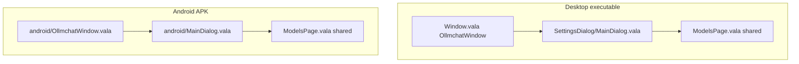

# 9.3 Android settings — lightweight `MainDialog` + reuse `ModelsPage`

> **Do not update `docs/plans/1.0-summary.md` for this plan.**

**Status:** **DONE** (2026-07-09) — Phases 0–2 implemented. Device issues archived in [`docs/bugs/done/2026-07-09-FIXED-android-poc-device-issues.md`](../../bugs/done/2026-07-09-FIXED-android-poc-device-issues.md).

**Parent:** [`9.0-DONE-android-poc-summary.md`](9.0-DONE-android-poc-summary.md) — Models settings tab (POC archived 2026-07-18)

**Pointer:** `docs/guide-to-writing-plans.md` — checklist; Vala follows `docs/coding-standards.md`.

**Golden rule:** **Android-only** — `ollmapp/android/`, Android meson. **No shared file edits** for this plan.

---

## Purpose

- **🔷** Replace the Android **manual** models tab with shared `ModelsPage` / `ModelRow`.
- **🔷** Use the **same-name, different-file** pattern for **two** desktop types on Android:
  - `SettingsDialog.MainDialog` — lightweight shell (Connections + Models only).
  - `OllmchatWindow` — lightweight main window (today’s `AndroidMainWindow` body, renamed).
- **🔷** **Do not** subclass desktop `MainDialog` or `Window.vala`.
- **🔷** **Do not** add `as AndroidMainWindow` branches in shared settings code.
- **🔷** Delete `AndroidSettingsDialog` and `AndroidMainWindow.vala` when done.

---

## Why Option B (user choice)

Shared settings code already assumes **`MainDialog`** parent and **`OllmchatWindow`** for `history_manager.connection_models` (`ModelsPage`, `Rows/Model.vala`, and more if we add tabs later).

| Approach | Every new shared settings feature… |
|----------|-----------------------------------|
| Option A — `as AndroidMainWindow` fallbacks | Another Android branch in shared files; golden-rule approval each time |
| **Option B — android `OllmchatWindow`** | Works unchanged; types match desktop |

One-time Android rename cost, then **zero** shared drift. Pairs with android `MainDialog` — same mental model, same long-term payoff.

---

## The pattern (both shells)

Desktop and Android **never link the same executable**. Meson picks different source lists.

| Class | Desktop source | Android source |
|-------|----------------|----------------|
| `SettingsDialog.MainDialog` | `SettingsDialog/MainDialog.vala` (4 tabs, 800×800) | `android/MainDialog.vala` (2 tabs, mobile size) |
| `OllmchatWindow` | `Window.vala` (full desktop shell) | `android/OllmchatWindow.vala` (chat + history overlay) |

Same class names. Different files. No casting. No subclass of desktop classes.

---

## Android `OllmchatWindow` — what it is

- **Rename** `AndroidMainWindow.vala` → `android/OllmchatWindow.vala`.
- **Class** `OLLMapp.OllmchatWindow` — same namespace/name as desktop.
- **Body:** unchanged mobile shell (chat-first, history overlay, bootstrap, `history_manager`, `ChatUserInterface`).
- **Do not** link desktop `Window.vala` on Android.
- **Minimum surface** shared code may expect:
  - `history_manager` (with `connection_models`)
  - `app` / `ChatUserInterface` fields already on `AndroidMainWindow`
  - `settings_dialog` → becomes `SettingsDialog.MainDialog`

**Call sites to update (Android only):** `AndroidApplication.vala`, `AndroidStartup.vala`, `AndroidBootstrapConnectionAdd.vala`, meson, log strings.

---

## Android `MainDialog` — what it is

Evolve `AndroidSettingsDialog.vala` → `android/MainDialog.vala` in `OLLMapp.SettingsDialog`.

| Piece | Notes |
|-------|--------|
| ViewStack + NARROW ViewSwitcher | From `AndroidSettingsDialog` |
| `ConnectionsPage`, `ModelsPage` | Shared pages — replace inlined UI |
| `action_bar_area`, `PullManager`, `PullManagerBanner` | Copy shell pattern from desktop |
| `public OllmchatWindow parent` | **Same signature as desktop** |
| `show_dialog`, `on_closed`, `check_all_connections` | Android TLS + `persist_config` where needed today |

**Not included:** Projects, Tools, desktop-only `show_dialog` extras.

---

## Rejected approaches

- **🚫** Subclass desktop `MainDialog` or `OllmchatWindow` — pulls desktop shell in.
- **🚫** Option A — `as AndroidMainWindow` in `ModelsPage` / `Rows/Model.vala` — short-term save, long-term shared-file tax.
- **🚫** `SettingsDialogHost` interface — touches ~15 shared files; Option B achieves the same without it.

---

## Phases

### Phase 0 — Meson (Android only)

**Add** to `android_poc_sources` (both Android cross-build blocks):

- `android/OllmchatWindow.vala` (rename from `AndroidMainWindow.vala`)
- `android/MainDialog.vala` (new)
- `SettingsDialog/SettingsPage.vala`
- `SettingsDialog/ConnectionsPage.vala`
- `SettingsDialog/ModelsPage.vala`
- `SettingsDialog/ModelRow.vala`
- `SettingsDialog/AddModelDialog.vala`
- `SettingsDialog/SearchablePulldown.vala`
- `SettingsDialog/PullStatus.vala`
- `SettingsDialog/PullManager.vala`
- `SettingsDialog/PullManagerThread.vala`
- `SettingsDialog/PullManagerBanner.vala`
- `SettingsDialog/Rows/*.vala` (all row types used by `ModelRow`)

**Do not add** desktop `Window.vala` or `SettingsDialog/MainDialog.vala`.

**Remove** from Android sources: `AndroidMainWindow.vala`, `AndroidSettingsDialog.vala`.

### Phase 1 — Android `OllmchatWindow` (Android only)

- **Rename/move** `AndroidMainWindow` → `OllmchatWindow` in `android/OllmchatWindow.vala`.
- **Update** `AndroidApplication`, `AndroidStartup`, `AndroidBootstrapConnectionAdd` — type `OllmchatWindow` everywhere.

### Phase 2 — Android `MainDialog` (Android only)

- **Add** `android/MainDialog.vala` — lightweight shell; `MainDialog(OllmchatWindow parent)`.
- **Delete** `AndroidSettingsDialog.vala`.
- **Wire** `OllmchatWindow.settings_dialog = new SettingsDialog.MainDialog(this)`.

### Phase 3 — Device verify

- Settings → Models tab: list matches chat bar.
- Expand model row, change option, close settings, config persists.
- Add Model / Refresh (if server reachable on device).

---

## What stays untouched

- **🚫** Desktop `Window.vala`, `SettingsDialog/MainDialog.vala`
- **🚫** Shared `ModelsPage`, `ModelRow`, `ConnectionsPage`, `Rows/*`
- **🚫** Projects, Tools, MCP on Android

---

## Suggested order (within 9.0)

1. Phase 0 meson
2. Phase 1 `OllmchatWindow` rename
3. Phase 2 android `MainDialog`
4. Phase 3 device verify

---

## Code map

| Role | File |
|------|------|
| Android main window (new name) | `ollmapp/android/OllmchatWindow.vala` |
| Android main window (remove) | `ollmapp/android/AndroidMainWindow.vala` |
| Android settings shell (new) | `ollmapp/android/MainDialog.vala` |
| Android settings shell (remove) | `ollmapp/android/AndroidSettingsDialog.vala` |
| Desktop (unchanged) | `ollmapp/Window.vala`, `SettingsDialog/MainDialog.vala` |
| Shared tabs | `ModelsPage.vala`, `ModelRow.vala`, `ConnectionsPage.vala` |
| Callers | `AndroidApplication.vala`, `AndroidStartup.vala` |
| Build | `ollmapp/meson.build` |

---

## Concrete code proposals

**⏳ Deferred** — add Remove/Replace hunks when implementation starts (Phases 0–2).
