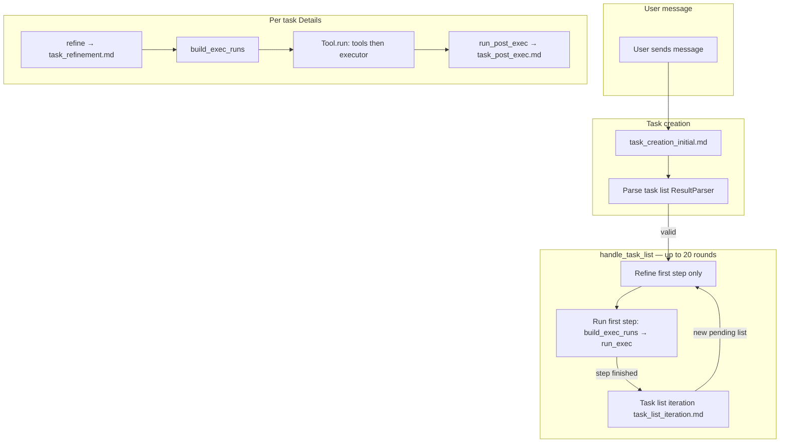

# Task and skills flow

This document explains **how the Skill Runner agent** turns a user request into a **task list**, runs **refinement** and **execution** per task, and optionally **iterates** the list. It complements the authoring guide [skills-format.md](skills-format.md), which defines task list shape, skill file layout, and executor output rules.

**Primary implementation:** `liboccoder/Skill/Runner.vala` (orchestration), `liboccoder/Task/List.vala`, `liboccoder/Task/Details.vala`, `liboccoder/Task/Tool.vala`, `liboccoder/Skill/Definition.vala`, `liboccoder/Skill/Manager.vala`. **Prompt templates:** `resources/skill-prompts/task_*.md`. **Skill definitions:** `resources/skills/*.md`.

---

## Concepts

| Concept | Role |
|--------|------|
| **Skill** | A markdown file with YAML front matter plus **Refinement** and **Execution** sections (split by `---`). The runner injects the refinement text into the refiner and the execution text into the executor. See `liboccoder/Skill/Definition.vala`. |
| **Skill catalog** | All skills under `resources/skills/`: **name** and **description** are exposed to the **task creator** so it only assigns real skills. |
| **Task** | One unit of work: **What is needed**, **Skill**, **References**, **Expected output**, optional **Name**, optional **Requires user approval**. Parsed from LLM output into `Details`. |
| **Task list** | Ordered **steps** (`Step`). Each step has one or more **tasks** (`Details`). The runner advances **one step at a time** (refine that step → execute that step → optionally iterate). |
| **Refinement** | An LLM pass that turns a coarse task into a **Refined task** (including **Skill call** with concrete arguments) and a **Tool Calls** section (JSON blocks). Tools are **not** executed during refinement; the model only emits text. |
| **Execution** | For each task: build one or more **execution runs** (`Tool` instances), run each tool call if present, then run the **executor** LLM with `task_execution.md` + skill execution body + “Tool Output and/or Reference information”. |
| **Post-exec** | After the executor runs, a final LLM pass (`task_post_exec.md`) merges run outputs into the canonical **`out_doc`** and **task post-exec summary** used for `task://…` links and iteration. |

**Pending vs completed:** `Runner.pending` is the list still to run; `Runner.completed` holds finished steps. Task output for linking is resolved from `completed` (and pending during a run) via **`ResolveLink.resolve`** (task scheme) after preload — same data as before; see `liboccoder/Task/ResolveLink.vala`.

---

## End-to-end flow



1. **Task creation** (`Runner.send_async` → `task_creation_prompt` → `task_creation_initial.md`): supplies user prompt, environment, project description, current file, **skill catalog**, and retry context if parsing failed. Chat tools are cleared so the model returns markdown only.
2. **Parse** (`ResultParser.parse_task_list`): builds `pending` `List` with steps and tasks; validates skills against `Skill.Manager`. On failure, up to **5** retries with previous proposal + issues.
3. **`handle_task_list`**: loops while `pending.steps` is non-empty: **refine** the first step only, then **run** that step (`run_step_until_approval` or after writer approval `run_step`). When a step fully completes, **`run_task_list_iteration`** may revise `pending` (compare to goals, add tasks). Writer tasks can require approval (stub may always approve).
4. **Per task** inside a step: `wait_refined` → `build_exec_runs` → `run_exec` → `write`.

---

## Task list shape (coarse plan)

The task creator outputs (at minimum):

- **Original prompt** / **Goals summary** — list-level intent; the **Goals summary** is preserved across **task list iteration** and is the yardstick for “are we done?”.
- **## Tasks** with **### Task section N** headings. Within a section, each task uses the exact labels: **What is needed**, **Skill**, **References**, **Expected output**, and optionally **Requires user approval** and **Name**.

**Sequential vs parallel:** Steps run in order. Within the current implementation, tasks in the same step are run **one after another** (`List.run_step` / `run_child`), not in parallel.

Skill names must appear in the catalog (`List.validate_skills`).

---

## Phase 1: Refinement

**Prompt:** `resources/skill-prompts/task_refinement.md`.

**Filled by** `Details.refinement_prompt()` / `Details.refine()`:

- Coarse task as markdown (`Details.to_markdown(REFINEMENT)`).
- **`skill_details`** — the skill file’s **Refinement** section (`Definition.refine`), not the whole file.
- **`task_reference_contents`** — resolved **References** (files, `#anchor` into the user request document, `task://…` slugs to prior task outputs).
- **`completed_task_list`** — completed tasks with result context for downstream refinement.
- Environment and project description.

The refiner must output parseable **Refined task** + **## Tool Calls** (fenced JSON: `name`, `arguments`). `ResultParser.extract_refinement` updates `Details.task_data`, `tools`, and `code_blocks`.

**Why refinement exists even when a skill lists no tools:** The refiner still wires **References** (e.g. adding links extracted from a prior task’s Detail). Skipping refinement for “no tools” skills would break those flows; see [docs/plans/done/6.4-REJECTED-skip-refinement-when-skill-has-no-tool-calls.md](plans/done/6.4-REJECTED-skip-refinement-when-skill-has-no-tool-calls.md).

Retries: up to **5** parse attempts; up to **3** communication retries per attempt.

---

## Phase 2: Execution runs

**`Details.build_exec_runs()`** chooses how many `Tool` rows run:

| Condition | Behaviour |
|-----------|-----------|
| **Tool Calls** present | One execution run per parsed tool; each run carries **all** `reference_targets` plus that tool’s call. |
| No tools, skill has **`execute-combined`** header | A single run with all references combined. |
| No tools, no combined | One run per reference link, or one run `id == "exec"` if there are no references. |

Each **`Tool.run()`** (see `liboccoder/Task/Tool.vala`):

1. Optionally executes the real chat **tool** (e.g. codebase search) and captures string output.
2. Loads file buffers for reference links.
3. Builds **executor** user content: tool output + reference contents.
4. Sends **`task_execution.md`** with skill **Execution** body and retry issues if needed (up to **5** tries).

Executor output is parsed into per-run **`summary`** and **`document`**. **`run_exec()`** runs **every** execution run in **`exec_runs`** in order (no early stop based on model text).

---

## Phase 3: Post-execution synthesis

**`Details.run_post_exec()`** uses `task_post_exec.md`. It passes the combined executor documents (`tool_runs_combined`), the task definition without tool calls (`POST_EXEC` phase), skill name, skill execution body, and optional retry issues. Parsed output fills **`out_doc`** (canonical markdown for downstream **`task://slug.md`** resolution) and **`post_summary`**.

This is what later tasks and iteration see as the stable **task result** (not the raw per-run executor markdown alone).

---

## Task list iteration

After a step completes, **`Runner.run_task_list_iteration`** runs `task_list_iteration.md` with:

- **Completed** task list (with result summaries appropriate for the phase).
- **Outstanding** (previous pending) task list.
- Environment, project description, skill catalog (system), and parse/validation issues on retry.

The model returns a **new** full task list; the runner replaces `pending` on success. Goals summary is carried over (`goals_summary_md`). This is how the plan grows when goals are not yet met.

Parse failures: up to **5** tries; unrecoverable failure cancels the session run.

---

## Task links (`task://`)

References to another task’s **canonical output** use **`[label](task://{slug}.md)`** — the URL **ends at `.md`**. Task lists, refinement, and executor prompts use that shape only; the runner injects the **full** **`out_doc`** for that slug.

Parsing (`libocmarkdown/document/Render.vala`): **`scheme`** is `task`, **`path`** is the segment after `task://` (no `/`), optional **`hash`**. **Resolution** (`ResolveLink.resolve`, task branch): empty **`hash`** → **`out_doc.to_markdown()`**; non-empty **`hash`** → that section only (legacy paths, tests, or malformed model output — not described to the LLM). **Prompts** and **`docs/skills-format.md`** describe URLs that **stop at `.md`**.

### Slug

Derived from **Name** via **`Details.slug()`**: lowercase; each run of non-alphanumeric → one hyphen; trim edges. **`List.fill_names()`** supplies a default name when missing. **`List.slugs`** maps slug → **`Details`** after **`Step.register_slugs()`** (see **`Step.vala`** for collisions).

### Storage

**`out_doc`** (in memory) and **`Details.write()`** → **`{task_dir}/{slug}.md`**. **`Markdown.Document.Document.register_heading()`** still assigns GFM-style keys to **`##` headings** (e.g. for in-document links in executor output and for optional non-empty **`hash`** resolution).

### Validation (summary)

**`Details.validate_link_task()`**: slug must exist and ordering rules apply (producer in an earlier section than consumer). **Post-exec** output must **not** use **`task://`** links pointing at **this** task (use **`##` headings** and prose instead). If a **`task://`** link includes a non-empty **`hash`**, the section must exist on the target document (error text may list **Available:** via **`header_links`**). Http(s) in **References** remains invalid at **REFINEMENT**.

### User-request anchors (not `task://`)

Empty path + **`#anchor`** resolves against **`Runner.user_request`** (task-creation template document).

---

## Skills: file format and runtime use

Skills are loaded as `Definition`: **YAML** → `---` → **refinement body** (second part; often starts with **`**During refinement**`**) → `---` → **execution body** (third part; often starts with **`**At execution**`**). The split is **`---` only** — do **not** rely on `## Refinement` / `## Execution` headings in skill files.

- **Refinement** part: instructions for the **refiner** (tools, arguments, reference hygiene).
- **Execution** part: instructions for the **executor** (how to interpret Precursor and shape output).

Optional YAML keys (non-exhaustive): **`tools`** (declared tool names), **`model`**, **`execute-combined`**. The manager validates that a task’s **Skill** field names a file / skill in the catalog.

Authoring rules and examples: **[docs/skills-format.md](skills-format.md)**.

---

## Prompt templates (runner-facing)

| Template | Purpose |
|----------|---------|
| `task_creation_initial.md` | First task list from user request + catalog |
| `task_refinement.md` | Refined task + tool calls for one task |
| `task_execution.md` | Executor / interpreter for one run |
| `task_post_exec.md` | Merge runs into canonical task output |
| `task_list_iteration.md` | Revise list after a completed step |

---

## Historical design notes

The original **Conductor / skills agent** vision (skill runner as a chat agent, catalog discovery, task bullet format) lives in [docs/plans/1.23-skills-agent-conductor.md](plans/1.23-skills-agent-conductor.md). The **implemented** pipeline (task list parsing, refinement, `Tool` execution runs, post-exec) evolved in the **1.23.x done** plans under `docs/plans/done/` (e.g. task execution prompt, refinements, detail/exec merge, task slugs). **Slug-only `task://` links (no `#` in prompts):** [1.23.33 DONE](plans/done/1.23.33-DONE-task-links-slug-only.md). Those plans are the changelog of design decisions; this document reflects the **current code path** above.

---

## Related code references

```329:378:liboccoder/Skill/Runner.vala
		private async void handle_task_list(GLib.Cancellable? cancellable = null) throws GLib.Error
		{
			this.writer_approval = false;
			var hit_max_rounds = true;
			for (var i = 0; i < 20; i++) {
				// ...
				yield this.pending.refine(cancellable);
				var step_done = yield this.pending.run_step_until_approval();
				if (step_done) {
					yield this.run_task_list_iteration(cancellable);
				}
				// ... writer approval ...
				yield this.pending.refine(cancellable);
				step_done = yield this.pending.run_step();
				if (step_done) {
					yield this.run_task_list_iteration(cancellable);
				}
				/* Next iteration: refine and run this.pending (the new list)'s first step. */
			}
```

```954:1002:liboccoder/Task/Details.vala
		public void build_exec_runs()
		{
			this.exec_runs.clear();
			var definition = this.skill_manager.fetch(this);
			var execute_combined = definition.header.has_key("execute-combined") &&
				definition.header.get("execute-combined").strip() != "";
			if (this.tools.size > 0) {
				this.add_exec_runs_for_tools();
				return;
			}
			if (execute_combined) {
				// ...
				return;
			}
			this.add_exec_runs_for_references();
		}

		public async void run_exec() throws GLib.Error
		{
			for (var i = 0; i < this.exec_runs.size; i++) {
				var ex = this.exec_runs.get(i);
				yield ex.run();
			}
			if (this.exec_runs.size > 1) {
				yield this.run_post_exec();
				this.exec_done = true;
				return;
			}
			var last = this.exec_runs.get(this.exec_runs.size - 1);
			this.post_summary = last.summary;
			this.out_doc = last.document;
			this.exec_done = true;
		}
```

**Task links — resolution:** `liboccoder/Task/ResolveLink.vala` (`task` branch); preload + `reference_contents` / executor use the same resolver.

```495:506:liboccoder/Task/Details.vala
	public string slug()
	{
		if (!this.task_data.has_key("Name")) {
			return "";
		}
		var name = this.task_data.get("Name").to_markdown().strip();
		if (name == "") {
			return "";
		}
		var s = new GLib.Regex("[^a-z0-9]+").replace(name.down(), -1, 0, "-");
		return new GLib.Regex("^-+|-+$").replace(s, -1, 0, "");
	}
```

```56:69:libocmarkdown/document/Document.vala
		internal void register_heading(Block b)
		{
			var raw = b.text_content().strip();
			if (raw == "") {
				return;
			}
			var key = new GLib.Regex("[^a-z0-9]+").replace(raw.down(), -1, 0, "-", 0);
			key = new GLib.Regex("^-+|-+$").replace(key, -1, 0, "", 0);
			if (key == "" || this.headings.has_key(key)) {
				return;
			}
			this.headings.set(key, b);
			this.header_list.add(key);
		}
```

Task reference validation branches on **`PhaseEnum`** in **`Details.validate_link_task()`** (same file, private method following **`validate_link()`**).
