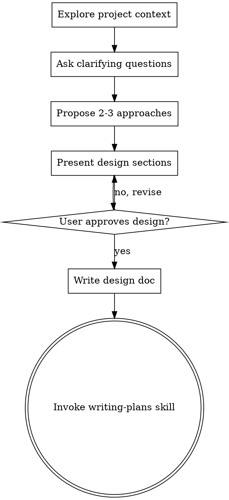

# Brainstorming Ideas Into Designs

## Purpose

Help turn ideas into fully formed designs and specs through natural collaborative dialogue.

## When to Use

Use this skill when:
- The request involves creating or changing behavior/features
- Requirements are ambiguous or incomplete
- Trade-off analysis is needed before implementation
- A design document must be approved before coding

## Progress Tracking

Display a progress gauge before each major phase:

```
[████░░░░░░░░░░░░░░░░] 20% — Phase 1/5: Exploring Project Context
[████████░░░░░░░░░░░░] 40% — Phase 2/5: Clarifying Requirements
[████████████░░░░░░░░] 60% — Phase 3/5: Proposing Approaches
[████████████████░░░░] 80% — Phase 4/5: Presenting Design
[████████████████████] 100% — Phase 5/5: Writing Design Doc
```

## Workflow

1. Explore project context
2. Ask clarifying questions one at a time
3. Propose 2-3 approaches with trade-offs
4. Present design sections and get approval
5. Save design doc and hand off to `writing-plans`

## Overview

Start by understanding the current project context, then ask questions one at a time to refine the idea. Once you understand what you're building, present the design and get user approval.

**Tools:** Agent Pi `read` / `write` / `edit` / `bash` / `codebase_search` as needed. Ask clarifying questions in chat (one at a time).

<HARD-GATE>
Present a design and get user approval before writing code, scaffolding, or other implementation work. This applies even when the project looks simple.
</HARD-GATE>

## Anti-Pattern: "This Is Too Simple To Need A Design"

Every project goes through this process. A todo list, a single-function utility, a config change — all of them. "Simple" projects are where unexamined assumptions cause the most wasted work. The design can be short (a few sentences for truly simple projects), but you MUST present it and get approval.

## Checklist

You MUST create a task for each of these items and complete them in order:

1. **Explore project context** — check files, docs, recent commits
2. **Ask clarifying questions** — one at a time, understand purpose/constraints/success criteria
3. **Propose 2-3 approaches** — with trade-offs and your recommendation
4. **Present design** — in sections scaled to their complexity, get user approval after each section
5. **Write design doc** — save to `docs/plans/YYYY-MM-DD-<topic>-design.md` and commit
6. **Transition to implementation** — invoke writing-plans skill to create implementation plan

## Process Flow



**The terminal state is invoking `writing-plans`.** That is the next skill after brainstorming.

## The Process

**Understanding the idea:**
- Check out the current project state first (files, docs, recent commits)
- Ask questions one at a time to refine the idea
- Prefer multiple choice questions when possible, but open-ended is fine too
- Only one question per message - if a topic needs more exploration, break it into multiple questions
- Focus on understanding: purpose, constraints, success criteria

**Exploring approaches:**
- Propose 2-3 different approaches with trade-offs
- Present options conversationally with your recommendation and reasoning
- Lead with your recommended option and explain why

**Presenting the design:**
- Once you believe you understand what you're building, present the design
- Scale each section to its complexity: a few sentences if straightforward, up to 200-300 words if nuanced
- Ask after each section whether it looks right so far
- Cover: architecture, components, data flow, error handling, testing
- Be ready to go back and clarify if something doesn't make sense

## After the Design

**Documentation:**
- Write the validated design to `docs/plans/YYYY-MM-DD-<topic>-design.md` with `write` / `edit`
- Commit only if the user wants a git commit

**Implementation:**
- Hand off to the `writing-plans` skill for the detailed implementation plan.

## Key Principles

- **One question at a time** - Don't overwhelm with multiple questions
- **Multiple choice preferred** - Easier to answer than open-ended when possible
- **YAGNI ruthlessly** - Remove unnecessary features from all designs
- **Explore alternatives** - Always propose 2-3 approaches before settling
- **Incremental validation** - Present design, get approval before moving on
- **Be flexible** - Go back and clarify when something doesn't make sense

## Critical Rules

- Get design approval before implementation.
- Discuss trade-offs across at least 2 approaches.
- Hand off to `writing-plans` for the implementation plan.

## Example Usage

1. "Use brainstorming to define a dashboard redesign before coding."
2. "Use brainstorming to clarify API requirements and constraints."
3. "Use brainstorming to compare architecture options for a new feature."
